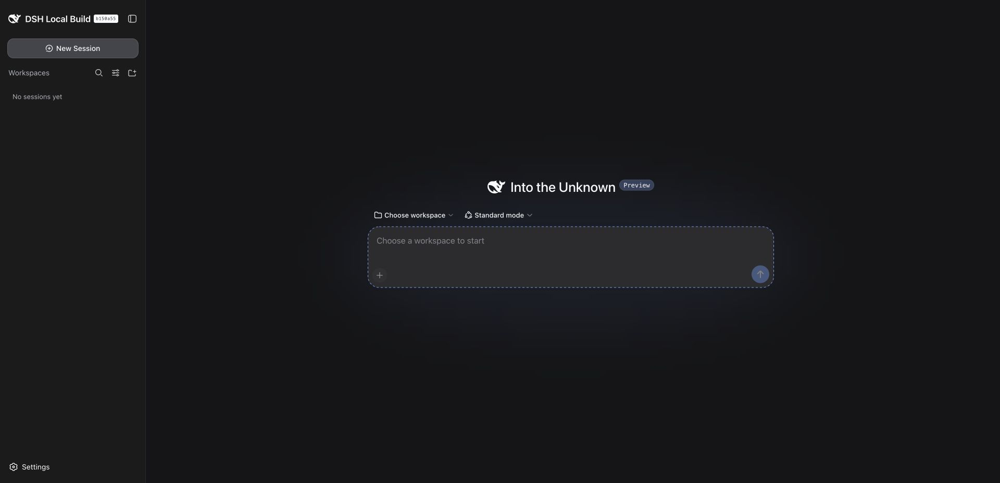

# 第 1 章：先把运行环境确认清楚

我在 macOS 上测试这份指南，实测日期为 2026 年 9 月 8 日。机器上已经安装 DeepSeek Harness，但这并不意味着重新装一台电脑时，只复制应用就能运行。

## 我实际运行的是哪个版本

应用包里的版本号是 `0.1.1-rc.2`。启动后，窗口左上角显示 `DSH Local Build` 和源码短提交号 `b150a55`。本地源码还包含未提交的桌面封装改动，因此本章描述的是这份本地构建，不能当作所有官方发行版的安装说明。

我检查了桌面壳的 README：它会启动本地 Node 进程运行 `dsh web`，等待服务报告地址后再打开界面。这解释了为什么应用刚打开时会先显示 `Starting local server…`。本次等待后成功进入首页。

本次 Node 版本为 `v25.8.0`，源码提交为 `b150a551b8d465e31e418e1b2eaf5e79bbb7d28e`。

## 单独启动书稿实验环境

为了不混用已有工作会话，我用独立的 `DSH_HOME` 启动另一个实例。它有自己的设置、工作区记录和会话目录。这里使用的是机器上已有的编译产物；没有重新安装 npm 包，也没有执行源码构建。

```sh
cd /Users/rui/Documents/ChatGPT/blog/book/deepseek-harness/lab
DSH_HOME=/Users/rui/Documents/ChatGPT/blog/book/deepseek-harness/runtime \
  node /Users/rui/project/github/deepseek-harness/apps/cli/lib/bin.js \
  web --no-open --port 0
```

`--port 0` 让系统分配端口。本次输出为：

```text
dsh web: http://127.0.0.1:56791
```

这是本次分配的地址，其他机器可能不同。打开命令实际输出的地址。`--no-open` 表示服务不自动拉起浏览器，适合已经打开浏览器或需要自己安排窗口时使用。

首次进入页面出现测试版说明，继续后要求配置 API key。点击 `Configure later` 能进入首页，但此时还不能据此判断模型已经可用。



## 添加工作区时弹出的是什么

这次操作里，我点击添加工作区后没有看到网页弹窗，一度误以为按钮没有响应。实际调用的是 macOS 的系统文件夹选择器。重复点击只会继续打扰桌面操作，应该停下来检查系统窗口。

本地源码 `packages/host/directory-picker-auto/src/resolve.ts` 说明了选择规则：macOS、本机回环地址、非 SSH 启动时，选用原生目录选择器。SSH 等环境会选择浏览式入口。这是源码核对结果；本次没有实测 SSH 场景。

实验最终固定为 `Harness Book Lab`。为避免再次弹出系统选择器，我停止实验服务后，只调整了实验实例自己的工作区记录，随后重启并在菜单里选中已有工作区。这是本次实验准备步骤，不冒充一次通过图形界面完整新建目录的演示。

## 本章验证到哪里

桌面启动、独立 Web 实例、首次配置提示和选择已有工作区已实际操作。全新机器安装、Windows、Linux、升级兼容性没有验证，因此本章不提供这些路径的成功保证。

下一章检查真正发送任务时会发生什么。能打开首页，只完成了启动。
