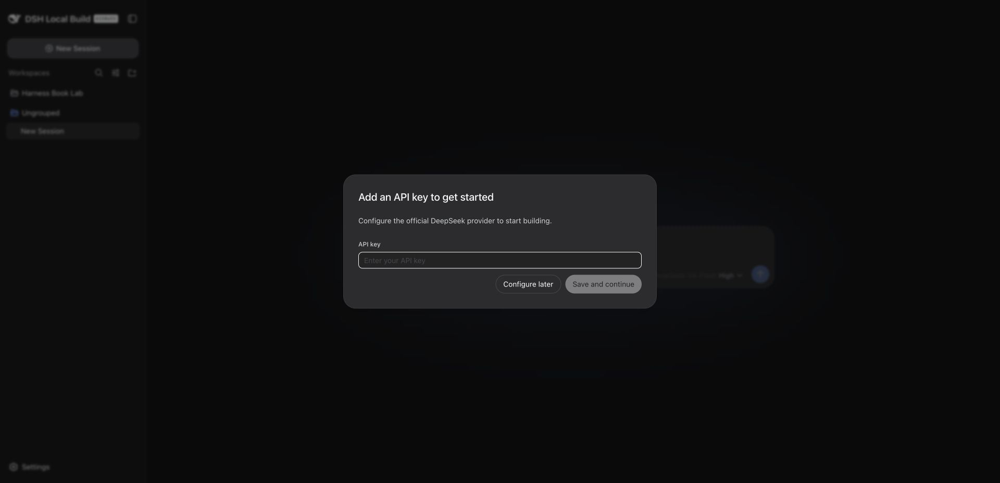
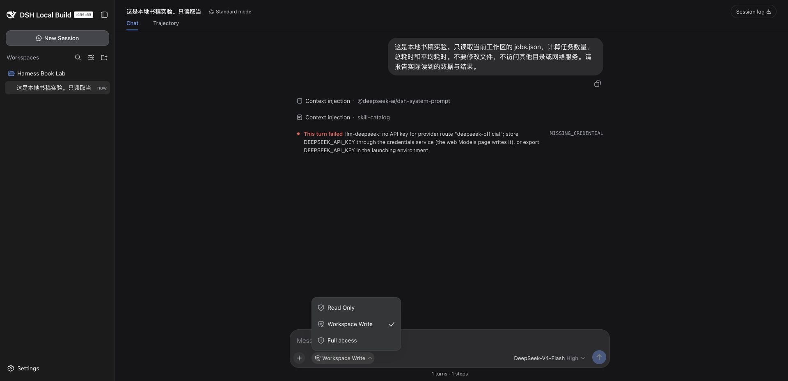

# 第 2 章：模型显示出来了，为什么仍然不能执行任务

第一次进入实验实例时，页面要求输入 DeepSeek API key。我选择稍后配置，进入工作区后，模型选择器仍然显示 `DeepSeek-V4-Flash · High`。



模型名称来自可选择的模型配置。它不是一次成功的模型请求，也不能证明账户和密钥可用。

## 用一个最小任务检查

实验目录里有 `jobs.json`，包含三条虚构任务数据：耗时分别为 12、8、10 秒。我发送了下面这段请求：

> 这是本地书稿实验。只读取当前工作区的 jobs.json，计算任务数量、总耗时和平均耗时。不要修改文件，不访问其他目录或网络服务。请报告实际读到的数据与结果。

实际界面没有返回计算结果，而是显示：

```text
This turn failed
llm-deepseek: no API key for provider route "deepseek-official";
store DEEPSEEK_API_KEY through the credentials service
(the web Models page writes it), or export DEEPSEEK_API_KEY
in the launching environment
MISSING_CREDENTIAL
```


本次失败发生在模型调用准备阶段。界面记录了系统提示与技能目录注入，但没有成功读文件的工具结果。不能把失败归因于 JSON 格式、计算逻辑或工作区文件权限。

## 正确的下一步

本版本文档给出两个接入方式：在 `Settings → Models` 保存实际的 DeepSeek API key，或通过启动进程的 `DEEPSEEK_API_KEY` 环境变量提供。自定义模型服务还需要配置它自己的地址和协议。

这里尚未完成密钥配置后的成功复测。不要把服务器 SSH 密码、业务平台 token 当作模型密钥。接通后必须重发同一任务，看到文件读取过程，再核对汇总结果。

为了有独立对照，我在 Harness 之外用 Node 读取样例，得到：

```json
{"count":3,"totalSeconds":30,"averageSeconds":10}
```

这是外部验算结果，不是 Harness 的回答。后续成功调用应与它对照。

## 权限入口与日志

我打开访问模式菜单，实际看到 `Read Only`、`Workspace Write`、`Full access`，并把实验会话切换为 `Read Only`，界面留下 `permission preset read-only` 记录。



这里只证明菜单和模式切换可用。由于模型调用尚未接通，还没有完成“尝试写入并被拒绝”的验证，不能直接写成只读隔离已经测试通过。

点击 `Session log` 后，页面提示浏览器开始下载 Session ZIP。日志导出入口已操作；压缩包内容与恢复流程还需要另行验证。
