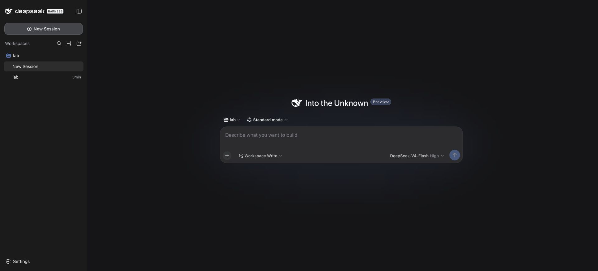

# 第 1 章：安装以后，先证明它真的完成了任务

我给第一次验收选了一个很小的任务：读三个作业的耗时，算数量、总和与平均值。它没有演示视频那么热闹，却容易检查。文件有没有读、数字有没有算对、是否误改文件，都能在模型之外确认。

这本书用的是 2026-09-08 的实验结果。官方包锁定为 `@deepseek-ai/dsh@0.1.1-rc.2`，本机 macOS，Node `v25.8.0`，pnpm `10.32.1`。这个组合是实验条件，不是最低版本要求，也不是所有平台的兼容承诺。后面分析源码所用的本地仓库还有桌面壳改动，因此我另外安装了官方 npm 包，独立完成第一次任务。

## 1.1 不先碰日常配置

我把安装目录、Harness home 和任务工作区分开：安装目录放程序，home 放 profile 与会话，工作区只放实验输入。三者混在一起，卸载插件时容易把任务文件也当缓存处理，截图时又容易带出凭据。

配套工程的 `runtime/` 不进入 Git。官方程序安装在 `runtime/official`，运行数据位于 `runtime/official-home`，任务样本在 `lab/`。读者可以换成自己的绝对路径，但同一次实验要始终使用同一个 `DSH_HOME`。

本次安装使用了锁定依赖的独立项目：

```json
{"private":true,"type":"module","dependencies":{"@deepseek-ai/dsh":"0.1.1-rc.2"}}
```

在这个目录执行 `pnpm install --ignore-scripts`。实际用时约 31 秒，安装 446 个包，出现 React peer dependency 警告。安装退出码为 0，但我没有把警告当作不存在；后面还要验证程序能启动、模型能调用工具。

此前一次 npm 安装长时间没有输出，我中止了它，再用 pnpm 完成安装。这只能说明本机当时的安装经历，不能据此断言 npm 不兼容。`--ignore-scripts` 也只是跳过安装脚本，运行程序时仍会执行包里的代码。

## 1.2 密钥和工作区各解决什么问题

密钥用于访问模型服务，不负责授予本地文件权限。反过来，给工作区写权限也不能修复模型鉴权失败。第一次运行时，我确实碰到了 `MISSING_CREDENTIAL`：页面正常出现，任务却没有成功执行。


实验启动器从本机受控文件读取密钥，只通过环境传给子进程，不把值写进书稿或启动命令。配套 `tools/run-harness.mjs` 展示了这个做法，并对输出做了密钥字符串脱敏。脱敏不是万能的：截图、其他日志或第三方插件都可能另有输出，所以原始运行目录仍不能直接发布。

读者正常安装后可以用 `dsh --profile web` 启动 Web profile。本书为了并行保留隔离实验，使用不同 home 和端口；端口号没有业务意义。自动化时我还在服务停止后预置了实验工作区记录，避免反复弹出目录选择器。这不是一次“通过图形界面添加目录”的测试。



## 1.3 第一个任务不要依赖模型自我评价

`lab/jobs.json` 包含三个 `durationSeconds`：12、8、10。提示语要求读取文件、汇总，不修改文件、不调用网络工具。原始任务在只读模式下完成；随后官方包的独立任务也保存了 `glob` 与 `read` 两次调用及成功结果。

正确结果是数量 3、总和 30 秒、平均值 10 秒。可以用下面的独立命令验算，而不是再问同一个模型“你确定吗”：

```sh
node --input-type=module -e 'import fs from "node:fs"; const x=JSON.parse(fs.readFileSync("lab/jobs.json","utf8"));const total=x.reduce((s,r)=>s+r.durationSeconds,0);console.log({count:x.length,totalSeconds:total,averageSeconds:total/x.length});'
```

命令从书稿目录执行。这里的“总和”只是观测耗时相加，不能直接说成整批并行作业用了 30 秒。第 6 章会看到，即使工具数字正确，模型也可能在这个解释上犯错。

## 1.4 怎样才算首次启动通过

我的验收有三层：页面能打开；会话中确实发生文件工具调用；结果与独立计算一致。只看到聊天气泡不够，模型可能根据提示猜出数字。只看到 HTTP 成功也不够，工具执行仍可能失败。

官方包独立成功会话的标识是 `session-5757be1e-8316-4f13-9341-ad2d6eeef6df`。脱敏事件索引在 [实验汇总](../evidence/experiments.json)，不包含模型密钥和完整推理文本。它是事件证据，不是服务端 HTTP 抓包。

如果第一次失败，先判断停在哪一层：程序没有起来，查启动输出；页面正常但报鉴权错误，查模型凭据；工具报路径错误，查会话工作区和文件是否存在；数字不对，再查输入和计算。不要在同一次排查里同时换模型、重装插件、放开权限，否则恢复后也不知道是哪一步起作用。
