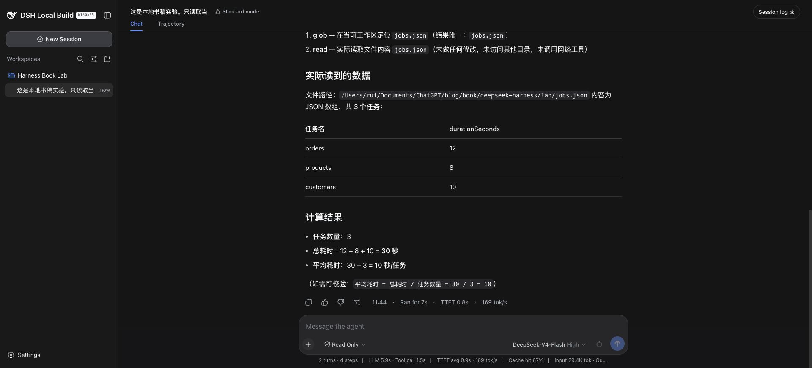
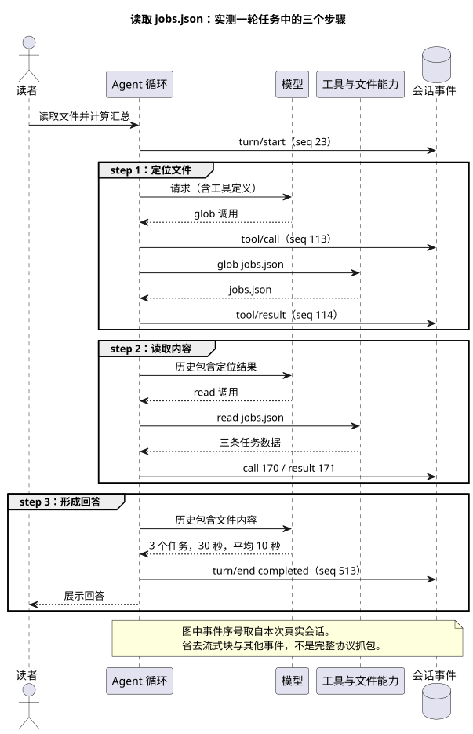

# 第 2 章：DSH 如何工作——插件如何组成一个 Agent

在界面里输入“读一下文件”，很容易把接下来发生的事情理解成模型读文件、模型算结果。实际执行时，模型并不能直接打开我的磁盘。它先提出工具调用，由 Harness 决定如何执行，再接收工具返回的内容。

这个过程本身并不是 DSH 独有的。我们要研究的是另一件事：在 DSH 里，负责组织这段过程的部件，也由插件装配起来。文件工具是插件，模型适配器是插件，保存会话记录的实现是插件，默认 Agent 循环同样是插件。

理解这一点，才能解释不少看似矛盾的故障：包已经装好，工具却没有出现；工具已经出现，操作却被拒绝；页面恢复了聊天记录，重新执行的结果却不相同。本章沿着一次真实读取任务，逐层看这些区别。

> 本章实验日期为 2026-09-08，环境为 macOS、Node v25.8.0，使用 `0.1.1-rc.2` 本地构建，源码提交 `b150a551b8d465e31e418e1b2eaf5e79bbb7d28e`。本地桌面壳有未提交改动，不代表干净的官方安装。正文区分实际执行、源码分析和未通过的验证；文末列出证据入口。

## 2.1 先看一次真正发生的调用

实验目录中只有一份简单的任务样本。这里的数据是人为构造的，不是生产日志：

```json
[
  {"name": "orders", "durationSeconds": 12},
  {"name": "products", "durationSeconds": 8},
  {"name": "customers", "durationSeconds": 10}
]
```

我让 DSH 实际读取 `jobs.json`，计算任务数量、总耗时和平均耗时，并明确要求不改文件、不调用网络工具。会话使用 Read Only 模式，界面选中的模型为 DeepSeek-V4-Flash，推理级别 High。

结果是 3 个任务、总耗时 30 秒、平均每个任务 10 秒。这里不需要复杂的评分系统，在 Harness 外用 Node 读取同一文件就能独立验算。更重要的是，DSH 并没有直接给出这三个数：它先调用 `glob` 找到文件，再调用 `read` 读取内容，然后才回答。



这张图说明界面确实显示了结果，但仅靠截图，还不能排除模型根据对话猜答案。我进一步检查了隔离实例保存的会话事件，找到两组对应的 `tool/call` 和 `tool/result`。`read` 的结果中确实有样本文件的五行内容，且 `isError` 为 false。

这一轮的事件可以缩成下面这张表。序号来自本次会话，不是为讲解编造的编号。

| 事件序号 | 内容 | 可以确认什么 |
| --- | --- | --- |
| 23 | `turn/start`，turn 2 | 第二轮任务开始 |
| 25 | `step/start`，step 1 | 开始第一个步骤 |
| 113、114 | `glob` 调用与结果 | 找到了 `jobs.json` |
| 116 | `step/start`，step 2 | 开始第二个步骤 |
| 170、171 | `read` 调用与结果 | 实际返回文件内容 |
| 173 | `step/start`，step 3 | 开始第三个步骤 |
| 513 | `turn/end`，completed | 该轮正常结束 |

为什么从 turn 2 开始？此前有一次未配置凭据的失败请求。旧记录没有被清掉，因此页面当时显示总计 2 turns、4 steps，其中一个步骤属于此前的失败。本次成功任务本身是三个步骤。



这先纠正一个容易影响排错的认识：一次发送不等于一次模型请求。模型提出工具调用后，Harness 需要执行工具，并把结果交给后续步骤。这个实验里是三步，但不是任何读取任务都必须三步；模型也可能直接读取已知路径。

## 2.2 DSH 的特点，不在于多装几个工具

如果插件只负责提供几个外部工具，那么 Agent 的请求流程通常仍由主程序固定控制。DSH 的设计把更多职责交给插件：连负责驱动步骤、创建和恢复 Agent 的实现，都在 `packages/core/agent-loop` 中。

这改变了扩展时首先要问的问题。我要增加一个行为，先找它应该参与的服务或事件，而不是先去主循环里加分支。给模型提供一个工具、观察工具结果、替换 Shell 的执行实现，是三个不同的扩展位置，不应该都塞进同一段代码。

当前源码中，`core/agent` 与 `core/agent-loop` 也不是同一件东西：前者承担 Agent 接口和注册等职责，后者提供默认的驱动实现。把接口与实现分开，才有讨论替换实现的空间。**可替换不等于任意实现都兼容**，会话事件、取消和清理等约定仍然要满足。本章没有替换默认循环，不能把架构允许的能力当作已做过的实验。

这套设计也有成本。扩展点多了，故障可能来自配置、依赖、作用域或生命周期，不能看到“插件不可用”就一律重新安装。我认为学习 DSH 最有用的起点，是先把这几层分开，而不是背下全部插件名字。

这里需要把两个时间点分开。启动阶段负责把能力装配好：文件服务是否存在、工具能否注册、默认循环由谁提供。发送任务以后，才进入运行阶段：从会话构建请求，等待模型输出，执行工具，再决定是否继续下一步。前者出错，常见表现是能力根本没有出现；后者出错，才会看到某次调用失败或某轮执行中断。

默认循环插件还负责 Agent 的生命周期。它内部的 `FactoryOwnership` 会追踪已经创建的 Agent 和尚未完成的启动工作；开始卸载时，先停止接受新工作，发出取消信号，再等待清理。如果只从界面移除插件，却让旧 Agent 继续使用它，后续请求就可能访问已经失效的服务。

这部分可在 [Agent 创建与清理实现](https://github.com/deepseek-ai/deepseek-harness/blob/b150a551b8d465e31e418e1b2eaf5e79bbb7d28e/packages/core/agent-loop/src/index.ts) 中核对，重点看 `FactoryOwnership.dispose()` 的执行顺序。理解本章不需要先读完整个文件。

## 2.3 启动时，哪些插件被装进来了

先看实际组装结果。对书稿的隔离实例，我运行了构建好的 CLI，指定相同的 `DSH_HOME` 和 web profile，再使用 `--dump-config`。读者使用已安装的 CLI 时，对应入口是：

```sh
dsh --profile web --dump-config
```

要注意使用同一个 Harness home；否则查的是另一套配置。配置输出还可能包含自己填入的服务地址或敏感字段，分享前应检查，不要直接把整份输出贴进公开讨论。

本次输出中能看到 `session-persistence-jsonl`、`tool-fs`、`tool-fs-search` 等条目。有些条目的来源注释同时标出了基础包和 Web 包：它们不只是“来自某个包”，还被后续组合层修改过。

这里涉及四个概念：

| 名称 | 在本章中如何理解 |
| --- | --- |
| 插件包 | 已经分发到本机、可被解析的代码 |
| Bundle | 声明一组配置补丁，把相关能力一起加入或修改 |
| Profile | 一套具名组合，记录使用哪些 Bundle 和自己的配置 |
| Cordis | 根据配置加载插件，处理服务依赖、事件和清理 |

`loadProfile()` 会读取 profile 声明的 Bundle 列表，逐个解析包路径，再查它的 `dsh.bundle.patch` 声明。一个包即使存在，如果被当成 Bundle 使用却没有对应声明，加载器也会报错。它不会猜“也许这是另一种插件格式”然后继续。

这解释了为什么不能把“npm 能安装”当作“DSH 能加载”的证据。包管理器主要解决依赖和文件，加载器还要理解包如何进入配置树。


配置层还存在顺序。Bundle 按 profile 的声明顺序组合，之后叠加 profile、home 和命令行的补丁。排查配置不生效时，要检查最后结果，不能只看最早写下的那份文件。尤其不要默认每个配置对象都按字段深合并；补丁的具体替换语义要看实现。

把这段加载过程写成输入与输出，会更清楚：`loadProfile()` 接收 profile 名称、安装位置和 Harness home，返回解析后的配置层；`composeEntries()` 再把这些补丁按顺序应用到空配置树，得到最终的插件条目。到这里得到的仍然是“准备加载什么”，并不是“所有服务已经工作正常”。

例如，一个包下载到了磁盘，但未列入当前 profile，它不会因为文件存在就自动生效。另一个包已经列入 profile，却缺少 `dsh.bundle.patch` 声明，加载器会在读取配置层时直接报错。这两种情况都发生在模型请求之前，换模型解决不了它们。

[配置层解析与组合实现](https://github.com/deepseek-ai/deepseek-harness/blob/b150a551b8d465e31e418e1b2eaf5e79bbb7d28e/packages/boot/app-boot/src/profile.ts#L358) 展示了上述输入输出和缺失声明的检查；[配置输出实现](https://github.com/deepseek-ai/deepseek-harness/blob/b150a551b8d465e31e418e1b2eaf5e79bbb7d28e/packages/boot/app-boot/src/index.ts#L379) 则用于核对命令输出。本节检查了实际组装结果，配置覆盖顺序的说明来自源码分析，尚未做逐层覆盖实验。

## 2.4 一个 read 工具背后有哪些协作

这次任务用到了 `read`。它所在的 `tool-fs` 插件明确声明依赖：

```ts
export const inject = ['tools', 'fs', 'systemPrompt']
```

这三个依赖分别与注册工具、访问文件能力、组织提示内容有关。文件工具不是直接把所有实现包起来，而是使用 `ctx.fs` 提供的文件能力。读取实现中能看到 `ctx.fs.readText()` 和 `ctx.fs.streamText()`：小文件读取与大文件流式读取由这里选择，但底层文件能力由提供方负责。

这样拆分的意义，可以用一次改造来理解。假设以后文件来自远程执行环境，工具仍然需要处理路径参数、读取范围和输出格式，这些职责并没有消失。变化的是文件能力的实现。把两者分开，可以减少针对每种后端复制一套工具的需要。

但不能据此说换一个配置就一定完成远程化。文件与进程是否处在同一个环境、路径如何解释、权限在哪里执行，都必须一起核对。本章的实际调用是本地读取，没有运行远程沙箱。

插件之间的合作也不仅是方法调用。需要观察一次工具执行，可以监听对应事件；需要贡献工具，通过注册表注册。当前 `register()` 实现返回移除注册的函数，并把注册交给作用域层的 effect 管理。插件卸载时能够撤销自己贡献的注册，靠的是这种生命周期管理，而不是简单删除 npm 包目录。

这并不表示卸载能撤销插件已经发送的网络请求，或恢复它已经写坏的文件。可清理的注册与外部世界的历史副作用，是两回事。

因此，排查 `read` 时可以沿着一条明确的关系往下走：先确认 `tool-fs` 的依赖已经满足，再确认它把读取工具注册给当前作用域，最后检查文件服务是否接受路径并返回内容。工具名称存在，只能说明注册这一层可见，不能代替最后一步的文件访问验证。

需要进一步核对时，[tool-fs 初始化代码](https://github.com/deepseek-ai/deepseek-harness/blob/b150a551b8d465e31e418e1b2eaf5e79bbb7d28e/packages/fs/tool-fs/src/index.ts#L19) 说明它依赖哪些服务；[read 实现](https://github.com/deepseek-ai/deepseek-harness/blob/b150a551b8d465e31e418e1b2eaf5e79bbb7d28e/packages/fs/tool-fs/src/read.ts#L136) 说明它怎样读取文件；[工具注册表](https://github.com/deepseek-ai/deepseek-harness/blob/b150a551b8d465e31e418e1b2eaf5e79bbb7d28e/packages/core/tools/src/index.ts#L1037) 说明注册怎样随作用域清理。三份代码分别回答三个问题，不必一次通读。

## 2.5 调用已经出现，为什么操作仍可能被拒绝

成功读取后，我保持 Read Only 不变，让 DSH 只尝试一次 `write`：在实验工作区创建 `permission-probe.txt`，内容为 `harness-book-probe`。请求明确要求一旦拒绝就停止，不升级权限，不换 Shell 或路径。

界面出现 Write 调用，结果是：

```text
Error: [sandbox: file access denied under read-only mode]
```


这是工具调用后的拒绝，不是模型只用文字说“我不能写”。我又在 Harness 外检查探针文件，结果是不存在。持久事件 646 记录了 `write`，647 的工具结果为 `isError: true`，没有第二次工具调用。

还有个容易漏看的细节：这一轮的 `turn/end` 仍然是 `completed`。它表示 Agent 已经完成本轮处理并向用户报告拒绝，不表示写文件成功。只统计“轮次正常结束”的数量，会把这种工具失败也混进去。评测时必须同时看工具结果和目标文件。

沿着源码看，工具执行不是一次裸露的 `execute()` 调用。前置事件能给出允许、拒绝或询问决策；允许后还要经过守卫；随后进入执行包装、工具实现和后续处理。工具内部也可能有更具体的权限检查。这次报错指向文件沙箱，不能单凭截图把它说成最外层审批拦截。


这里有两组很像的名称，写插件时必须分清：

| 名称 | 用途 |
| --- | --- |
| `tools/pre-execute`、`tools/execute`、`tools/post-execute` | 运行时扩展点，参与调用处理 |
| `tools/result` | 观察最终结果的运行时通知 |
| `tool/call`、`tool/result` | 保存在会话中的调用与结果事件 |

复数 `tools` 与单数 `tool` 不是拼写随意。一个描述处理过程，一个记录会话事实。最终结果观察者也不应该被当成继续任意改写结果的地方。

有些事件采用 waterfall 方式串接。监听器若需要把处理交给后续逻辑，要调用 `next()`；不调用就可能截断链路。因此，“我只是装了一个观察插件，为什么原功能不执行了”不能只查插件有没有抛异常，还要查它是否正确委托。

同样，不能把所有事件监听器都写成 waterfall。事件类型和调用约定要对应，不能看到名字以 `agent/` 开头就照抄一段模板。

如果要从代码复查这次拒绝，应先读 [工具执行准备过程](https://github.com/deepseek-ai/deepseek-harness/blob/b150a551b8d465e31e418e1b2eaf5e79bbb7d28e/packages/core/tools/src/index.ts#L1463)，辨认哪些阶段发生在工具实现之前；再读 [调用与结果的会话记录过程](https://github.com/deepseek-ai/deepseek-harness/blob/b150a551b8d465e31e418e1b2eaf5e79bbb7d28e/packages/core/agent-loop/src/tool-calls.ts#L261)，理解失败为何仍会留下成对记录。本次文件沙箱拒绝只是其中一条实测路径，不能据此判断所有工具都受到相同约束。

## 2.6 会话记录为什么参与下一次请求

在这次成功任务中，第二步能读到第一步定位的结果，第三步能依据第二步的文件内容回答。去看默认循环的 `step()`，它构建请求时调用了：

```ts
const { request, preparedCall } = await this.buildRequest(
  turn, step, assembly.tools, system, this.session.deriveMessages(), signal,
)
```

这行调用的重要之处在于，历史不是从页面上的聊天气泡重新拼出来，而是从 Session 推导。界面与模型使用的数据有联系，但两者不是同一个展示列表。

`deriveMessages()` 也不是把日志每行都塞给模型。当前实现沿着 session surface 中的消息节点进行投影。轮次边界和流式块并不自动变成独立的对话消息；发生替换型的上下文整理时，推导缓存也要重建。否则越运行越重复，旧内容还可能被错误带回来。

这对排错很有用。用户说“模型像是没看到工具结果”，我们可以继续问：结果是否写入了会话？它是否属于模型历史的投影？请求头和工具定义是什么？问题不必停留在“这个模型不聪明”。

本次持久记录中的 `tool/result` 通过 `sourceEventSeqs` 指回调用事件。例如读取结果 171 指向调用 170。核对时不要只按相邻两行猜配对，应该使用记录中的关联信息。

DSH 还提供了请求重建的不变量检查插件。其源码把循环构建的请求与 `deriveMessages()`、折叠后的请求头比较；无日志来源的消息、模型配置或工具定义不一致，会触发检查。这个检查针对带循环标记的请求，不能扩大成任何第三方请求都受它保护。

我运行了对应的 `invariant.spec.ts`，8 项测试通过。其中包括给请求增加一条没有写入日志的消息、改动模型字段等反例。这些是构造测试，不是对模型服务端收到的 HTTP 请求逐字抓包。本次真实任务另有会话记录和界面结果，两种证据各自说明不同的事情。

还要避免另一个误解：能重建请求，不等于再调用一次必然得到同样回答。模型版本、采样、外部文件状态和工具环境都可能变化。会话日志让差异更容易核对，并不会消除这些变量。

这也解释了会话记录在 DSH 中为什么不只是聊天存档。下一次请求需要从它恢复模型可见的历史，诊断工具又需要用它检查实际请求是否有据可查。记录缺失，可能影响后续行为；界面少显示一项，则未必表示模型也没有收到。两者必须分别检查。

实现上的对应关系是：[循环的请求构建](https://github.com/deepseek-ai/deepseek-harness/blob/b150a551b8d465e31e418e1b2eaf5e79bbb7d28e/packages/core/agent-loop/src/agent.ts#L332) 消费历史，[Session 的历史推导](https://github.com/deepseek-ai/deepseek-harness/blob/b150a551b8d465e31e418e1b2eaf5e79bbb7d28e/packages/core/session/src/index.ts#L726) 提供历史，[请求不变量检查](https://github.com/deepseek-ai/deepseek-harness/blob/b150a551b8d465e31e418e1b2eaf5e79bbb7d28e/packages/core/agent-loop/src/invariant.ts) 比较两者是否一致。读源码时沿着这个方向，比按目录顺序阅读更容易理解。

## 2.7 用这套结构判断问题发生在哪里

回头看实验中的第一次失败：界面能启动，模型名称也存在，系统上下文已经注入，但轮次结束原因是 `MISSING_CREDENTIAL`，没有成功的文件工具调用。

这时去修改 JSON 内容或给工作区增加写权限，没有针对已经观察到的失败。凭据配置后重新发送任务，才出现 `glob`、`read` 和正确汇总。由于第二次的提示语和会话状态也有变化，这不是严格的单变量性能实验；它能确认的是凭据错误消失，真实文件读取成功。

再看只读写入实验：已经出现 `write` 调用，结果明确拒绝文件访问。此时模型接入显然不是第一排查对象，应该检查执行策略。把错误发生的阶段找准，比反复换模型有用。

面对社区问题，可以先用这张短表决定查哪里：

| 观察到的现象 | 先检查什么 | 不应该立即下的结论 |
| --- | --- | --- |
| 安装命令失败 | 依赖解析、包路径、包管理器环境 | 插件业务逻辑有 bug |
| 包存在，配置树没有它 | profile 与 Bundle 声明 | 模型不会调用工具 |
| 配置树有它，服务没就绪 | 加载错误与依赖 | 重新下载就能好 |
| 工具调用出现，结果拒绝 | 策略、审批、工具内部检查 | 文件已经发生修改 |
| 工具结果正确，回答不对 | 历史投影、实际请求与模型回答 | 文件读取失败 |

社区投稿中，旧 `file:/tmp/…tgz` 引用导致安装新插件时报错，就是第一类线索。报错由安装新插件触发，根因却可能是旧依赖已经失效。这个案例由 [pbni-132 报告](https://github.com/deepseek-ai/deepseek-harness/discussions/1477#discussioncomment-18311978)，本书后续用构造的坏引用复现了同类机制，过程见第 4 章。

## 2.8 测试失败以后，我只改了模块解析顺序

源码中的工具注册表支持作用域，设计意图是让不同 Agent 使用各自的工具集合。然而，我在本地运行 `scoped.spec.ts` 时，27 项中有 14 项失败。失败包括工具可见范围和作用域内拦截等断言。

随后检查工作区，发现部分源码目录同时存在 `.ts` 和生成的 `.js`。我没有删除这些文件，也没有修改宿主实现，而是在书稿目录建立独立 Vitest 配置，把 TypeScript 扩展名放在解析顺序前面，再运行同一组测试。结果是作用域 27 项、请求不变量 8 项，合计 35 项全部通过。

这组对照把问题缩小到了本地模块解析与构建产物混用。源码里的作用域依赖模块内的 Symbol 和映射表；加载两份实现会影响身份判断。不过本次没有完整记录解析器加载的全部路径，所以我不把“双份模块”写成已经逐一证明的最终根因。能够确认的是：同一源码、同一测试集，优先解析 TypeScript 后失败消失。配置保存在 `tools/vitest-source-only.config.mts`，没有覆盖原仓库配置。

本章已经验证配置输出、真实读取、只读写入拒绝和上述 35 项构造测试。构造测试通过不等于完成了多 Agent 生产隔离审计；替换默认循环、远程能力实现和 waterfall 误用也没有在这里实测。另用官方 npm 的同版本包完成了独立读取任务，见第 1 章，避免全书只依赖带本地改动的构建。

## 实验材料与继续阅读

- [事件提取与独立验算脚本](../tools/summarize-session.mjs)：只导出事件结构，不导出完整提示词、推理内容或密钥。
- [本次验证记录](../evidence/02-validation.md)：命令、通过与失败范围。
- [本次事件摘要](../evidence/02-session-summary.json)：由隔离会话自动提取。
- [社区案例台账](../community/cases.md)：保留投稿署名和复测状态。
- [固定提交的架构文档](https://github.com/deepseek-ai/deepseek-harness/blob/b150a551b8d465e31e418e1b2eaf5e79bbb7d28e/docs/architecture.zh.md)：用于查阅术语和其他扩展入口。

读到这里，再遇到“装了插件但没反应”，应该能先提出几个具体问题：代码有没有装到当前 profile？加载器有没有接受它的声明？需要的服务是否存在？当前 Agent 是否使用它？调用究竟停在了哪一步？下一章就沿着这些问题，实际检查一个插件从安装到生效的全过程。
