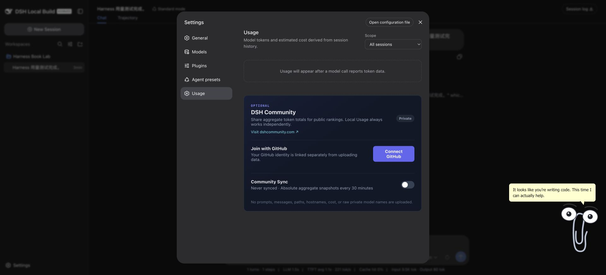

# 第 5 章：社区插件实际装起来，结果怎样

本章选了两个投稿插件：sjh9714 的 Clippy 和 kestiny18 的 Usage。前者让会话状态可见，后者统计模型用量。加上前面的作业汇总工具，构成一个小工作流：读数据、看执行状态、核对调用开销。

结果并不是三个功能都完全通过。原创工具能正确汇总；Clippy 能显示并响应状态接口，但动态事件表现没有完整验收；Usage 页面存在，统计却为空。把这些差别写清楚，比放一排安装命令更有参考价值。

## 5.1 下载之后，运行之前

我先用 `npm pack --ignore-scripts` 获取固定版本归档，检查 manifest、入口和关键实现，再装入专用 home。实际版本为 `dsh-clippy@0.2.1`、`dsh-usage@0.2.5`。投稿时的版本并不相同，不能把作者早期的测试结果直接套在今天的包上。

两个包安装时都有 peer dependency 警告。警告没有阻止安装，也不能因此忽略。后续实验只针对当前 macOS、Node v25.8.0、宿主本地构建 0.1.1-rc.2、Web profile。这里没有验证桌面发行版和 Windows。

安装脚本不是唯一风险点。插件启动后也能执行代码、监听事件或访问服务；`--ignore-scripts` 不会把第三方代码变成沙箱代码。

## 5.2 Clippy：界面出现，不等于事件全测过

来源：[sjh9714 的投稿](https://github.com/deepseek-ai/deepseek-harness/discussions/1477#discussioncomment-18024040)。我看到的实现由宿主状态服务和客户端展示组成，客户端轮询同源 `/api/clippy/state`，宿主侧监听会话事件并更新阶段。

实测中，页面能显示 Clippy，状态接口返回 HTTP 200 和 idle 状态。这同时验证了后端路由存在与客户端组件能渲染，不只是 npm 安装成功。

但本次没有逐个捕获思考、工具执行、失败、完成状态的转换。任务很短，空闲状态又会恢复，最后看到 idle 不能证明中间所有事件都正常。因此兼容表记为“部分通过”，而不是“完全兼容”。后续若专门测这个插件，应设计持续时间可控的任务，逐个检查状态与事件时间，而不是靠印象判断动画动过没有。

## 5.3 Usage：有 token，为什么还是空白

来源：[kestiny18 的投稿](https://github.com/deepseek-ai/deepseek-harness/discussions/1477#discussioncomment-18024567)。本次启动后设置页出现 Usage。我发送一个不需要工具的短任务，模型确实回答完成，会话底部显示输入 9,471、输出 80 token，Usage 页却仍提示调用后才会出现数据。重新加载页面也没有恢复。

下一步不应该立刻换密钥。持久会话中序号 100 的 `assistant/message` 已经有 `usage`，包括 `inputTokens=9471`、`outputTokens=80`。模型没有返回用量的假设，与记录矛盾。

我再把同一份事件交给插件导出的 `foldModelCostEvents()`，脱离页面执行统计。结果是一条请求、9,471 未缓存输入、80 输出，与会话一致。为了只验计数，独立试验使用零费率，输出的费用 0 **不是实际账单**。

这一步把排查范围缩小到统计注册、会话投影传播或客户端读取等连接环节，尚未定位最终根因。它不能证明每种事件都能正确统计，但能排除“这份会话完全无法被该统计函数处理”。我没有修改第三方代码来让截图好看，也没有把空白页写成已修复。配套 [重放脚本](../tools/replay-usage.mjs) 与 [计数结果](../evidence/usage-replay.json) 保留了这个检查；脚本需要本机私有实验日志，分发包不包含原始会话。

## 5.4 费用和社区同步需要单独验收

用量统计与实际扣费不同。计价依赖提供方、模型、缓存类别、费率生效时间。插件内置的价格表是配置，不是付款凭证；本书没有拿它核对账户账单，也不据此报价。

该插件还有社区同步能力。本次保持 Private、Never synced，没有连接 GitHub，也没有启用同步。源码中有按条件运行的同步逻辑，不能因为本地统计功能看起来无害，就替用户同意上传数据。

要把这套工作流用于日常，作业统计目前可继续使用；Clippy 属于展示功能的部分验证；Usage 尚不能充当本机可靠的费用看板。失败记录和版本条件都留在附录，升级后重测同一任务才有可比性。
