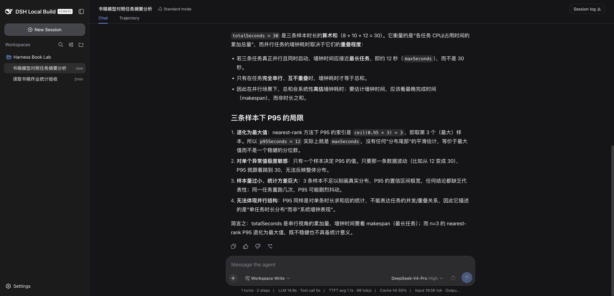
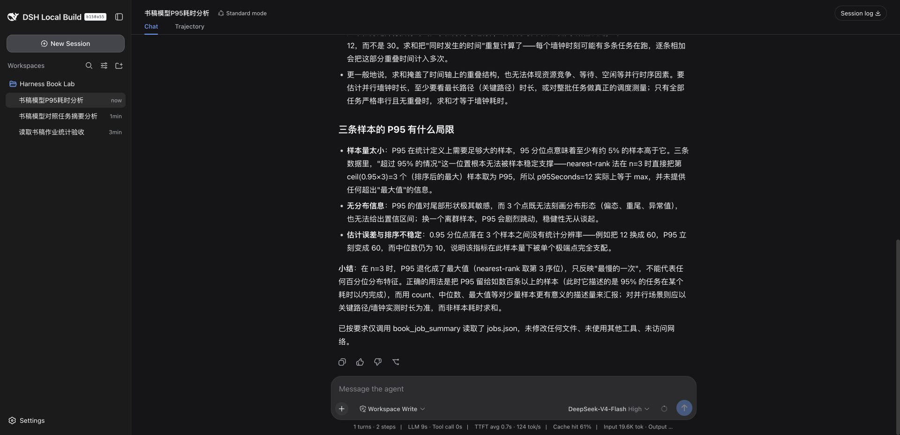

# 第 6 章：模型算对了，解释仍然可能错

我原本以为这个实验主要会比较速度。实际更有价值的发现是：两个模型都拿到了正确工具结果，却都在解释时超出了数据允许的范围。

## 6.1 先把比较任务固定下来

使用新建的独立会话、同一个工作区、同一版 `book_job_summary`，推理级别均为 High，访问模式均为 Workspace Write。提示要求只调用这个工具，返回 count、totalSeconds、averageSeconds、p95Seconds，并解释总和为什么不是并行墙钟耗时、三个样本的 P95 有何局限。

本次各执行一次，模型是界面中的 DeepSeek-V4-Pro 与 DeepSeek-V4-Flash。没有声称锁定服务端内部权重版本，也没有做交替多轮采样。这是一次小型对照，不是性能榜单。

| 观察项 | Pro | Flash |
| --- | --- | --- |
| 四个数字 | 3 / 30 / 10 / 12，正确 | 3 / 30 / 10 / 12，正确 |
| 工具 | book_job_summary | book_job_summary |
| 界面该轮耗时 | 约 14 秒 | 约 9 秒 |
| 界面输入 | 约 19.5K token | 约 19.6K token |
| 界面输出 | 840 token | 958 token |
| 界面缓存命中 | 50% | 61% |

这些数来自当时 UI，不是独立网络基准。缓存条件不同，样本数又只有一，不能从中得出普遍的速度、成本或质量排序。

## 6.2 第一个错误：把最长任务当成整批耗时

两个回答都把最长的 12 秒推广成并行任务的墙钟耗时。只有进一步知道任务同时开始、没有额外等待等条件，这样的计算才成立。样本只给了各自耗时，没有开始时间或依赖关系。

一个假设反例就能检验这个说法：仍然是 12、8、10 秒，但三个任务分别在第 0、100、200 秒开始，最后一个在第 210 秒结束。从首个任务开始到最后结束，跨度为 210 秒。它们的耗时和仍然是 30 秒。这是教学反例，不是原样本的隐藏运行记录。

Pro 还把耗时求和描述成 CPU 或占用时间的总量。输入字段叫 `durationSeconds`，没有 CPU 计时定义，因此这个解释没有依据。若要算资源占用，需要资源数量及时间口径；若要算 CPU 时间，需要相应计量字段。

正确回答应停在数据边界：当前能够计算耗时分布，不能还原整批墙钟时长。这个边界比多写几句并行计算术语重要。

## 6.3 第二个错误：把估计不稳定说成无法定义

nearest-rank 的样本 P95 就是排序后第 `ceil(0.95*n)` 个值。n=3 时取第三个，所以是 12。这个计算定义明确，不要求样本中一定有恰好 5% 的值高于它。

真正的限制是：只有三个观测，用它判断生产总体尾延迟很不稳。一次异常就可能改变结果，样本如何采集、是否独立、是否覆盖高峰也都未知。“可计算”与“足以支持生产结论”不是一回事。

因此验收应该分成工具层和解释层：工具是否按约定计算；模型是否正确描述指标、没有补造时间轴或计量语义。本次工具层通过，解释层有错误。若只比最终答案里有没有 3、30、10，两个回答都会被误判为全部正确。

## 6.4 如何把一次对照变成可用评测

先确定几类任务：正常输入、坏输入、缺少信息、拒绝执行、长上下文后仍需保留的约束。每个任务写下可判定结果和不允许做的事，再记录模型标识、推理级别、插件版本、工具序列与用量。

需要比较时，重复运行并交替顺序，保留失败，不只挑最好的一次。任务成本还应包括重试和人工修正，不只是输出 token。没有真实重复样本，本书不填一张看似完整的均值和 P95 表。

本次坏输入任务另行实测：把 durationSeconds 写成字符串，工具拒绝，模型没有换工具绕过，也没有修改文件。它验证了一个失败场景，但不能替代长上下文、取消和多轮恢复等尚未测试的场景。
