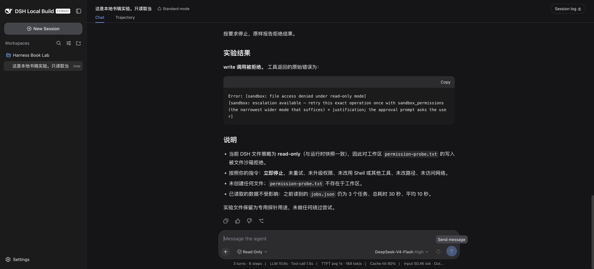

# 第 7 章：权限、Shell 和工作区，不是一回事

“只读模式下模型说写入失败”和“文件真的没有写入”，是两份需要相互核对的证据。我实际让它尝试写一个无害实验文件，工具拒绝后，又在 Harness 外检查文件不存在。

## 7.1 一次真正被拒绝的写入

目标是实验工作区内的 `permission-probe.txt`，不是个人文件。会话在 Read Only 下出现 write 调用，结果 `isError=true`，最终轮次却以 completed 结束。

这没有冲突：Agent 正常告诉用户失败，也可以算轮次完成。监控系统只统计 completed，会漏掉工具层拒绝。第 2 章的事件摘要保留了调用与结果关联，也记录了独立检查 `probeExists=false`。

这只验证了本地文件工具的一条路径，不证明所有第三方插件都无法绕过权限。一个插件如果直接使用 Node API，其行为不能自动等同于宿主文件工具的策略。安装第三方代码本身就是信任边界。

## 7.2 Shell 到底在哪运行

在 Workspace Write 模式下，我只要求 bash 执行 `pwd` 和 `node --version`，不读取环境变量、不联网、不改文件。两次工具调用成功，返回书稿 lab 的绝对路径和 `v25.8.0`。

这两个小命令适合先确认环境。终端里自己运行的 Node，与服务进程找到的 Node 未必一样。遇到 Windows 的 `/bin/bash`、MSYS2 退出码 127 等报告，应先确认宿主实际选中的执行实现和可执行文件，而不是把自己的交互式终端配置当作服务环境。

这里没有运行危险命令，也没有验证网络隔离。任务提示中的“不访问网络”是对 Agent 的要求，不等于操作系统已经限制所有进程出网。

## 7.3 原创工具的边界在哪里

示例工具要求会话有工作区，通过宿主 `resolve()` 解析工作区和目标，再用 `contains()` 检查包含关系，检查是普通文件且大小不超过 1 MiB，最后读取、解析和校验数据。

它不直接写文件，不调用网络。但仍有明确局限：路径入口只接受 POSIX 绝对路径；文件大小检查与读取之间有时间窗口；符号链接和远程文件实现还受提供方语义影响。本书没有做完整沙箱审计，不能给它贴“绝对安全”的标签。

读取前做大小检查，读取后再做字符数检查，可以挡住一些误用，不是严格的内存上限。若输入来自不可信来源，应使用真正受限的读取方式，并针对宿主文件服务的实际能力做测试。

## 7.4 求助日志也需要权限意识

不要为了确认模型配置而打印全部环境变量，也不要把完整 home 打包发到讨论区。请求头、提示、文件内容和第三方服务地址可能夹在日志里。

本书的导出脚本只保留事件类型、序号、工具名称、成功失败和计数等字段。原始压缩会话留在被 Git 忽略的 runtime。公开截图仍要人工检查，结构化日志的脱敏不能替代截图检查。
