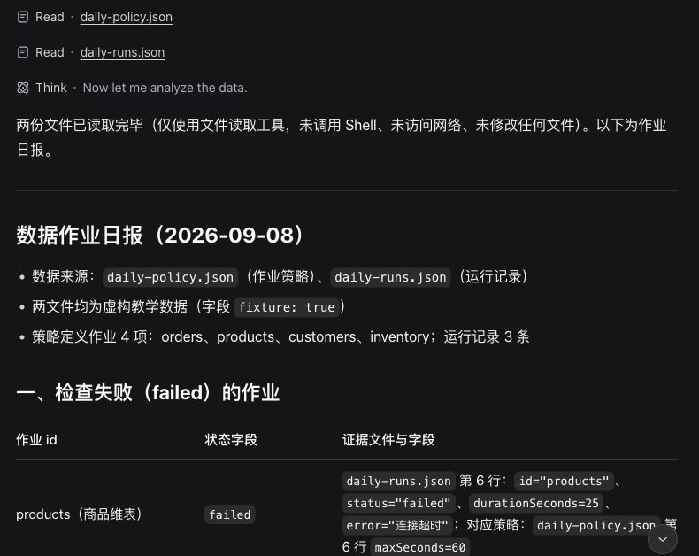
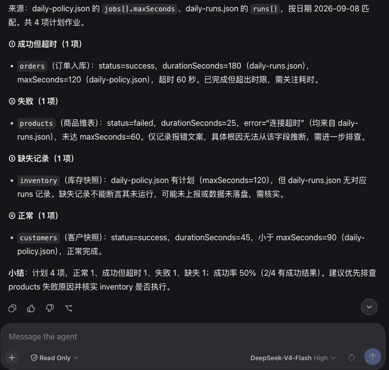

# 第 2 章：让助手读文件，交出第一份日报

这一章先不写插件。Harness 已经提供文件读取工具，我们用它完成第一份报告，看看现成能力能做到哪一步。

需要准备 Node、pnpm，以及你自己的模型服务凭据。模型请求会把任务文字和读取到的材料发送给模型提供方，所以先用随书的虚构数据，不要拿公司的原始日志尝试。密钥也不要放进任务目录或粘贴到聊天框。

## 2.1 程序和任务文件分开放

建一个专门的练习目录，其中 `app` 放安装的程序，`workspace` 放要分析的文件。另一个 `home` 目录留给 Harness 保存配置和会话。

```text
harness-daily/
├── app/
├── workspace/
│   ├── daily-policy.json
│   └── daily-runs.json
└── home/
```

这里的目录名由你决定。工作区只选 `workspace`，不要为了省事把整个个人主目录交给助手。

在 `app/package.json` 保存以下内容，然后在 `app` 目录运行 `pnpm install --ignore-scripts`：

```json
{
  "private": true,
  "type": "module",
  "dependencies": {
    "@deepseek-ai/dsh": "0.1.1-rc.2"
  }
}
```

固定版本是为了使书中的操作可以对照，并不意味着以后都应该使用这个版本。`--ignore-scripts` 跳过依赖的安装脚本，不能限制程序启动后的行为。

## 2.2 准备两份材料

把随书的 [daily-policy.json](daily-policy.json) 和 [daily-runs.json](daily-runs.json) 放入 `workspace`。第一份列出预期作业及阈值，第二份列出当天结果。

例如，规则中 `orders.maxSeconds` 为 120，当天 `orders.durationSeconds` 为 180，状态为 `success`。报告应该写“成功但超过阈值”，不能把它改成执行失败。`inventory` 只出现在规则中，它对应的是缺少记录。

日期也要一致。今天的规则配上昨天的数据，即使模型算得正确，日报仍然用错了材料。

## 2.3 启动，选择工作区

从 `app` 目录启动 Web 界面。把下列 `DSH_HOME` 换成练习目录中 `home` 的绝对路径：

```sh
DSH_HOME=/你的练习目录/harness-daily/home pnpm exec dsh --profile web
```

终端会显示本地地址。打开它，选择练习的 `workspace` 作为工作区。模型需要有效凭据；缺少凭据时，页面可能正常显示，但发送任务会报鉴权错误。不要通过增加文件写权限处理鉴权问题。

本书实测使用 `DEEPSEEK_API_KEY` 环境变量把密钥传给程序，启动器从受控文件读取，命令中不出现密钥值。你若已有安全的环境变量管理方式，可以沿用。不要把实际密钥写进将要提交 Git 的配置或 shell 示例。

发送之前，点输入框附近的访问模式，选择 `Read Only`。本章只需要读材料；不要选 `Full access`。模型名称和权限模式是两项独立设置。

## 2.4 给它一个明确任务

把下面这段发送到新会话：

```text
读取工作区 daily-policy.json 和 daily-runs.json，生成当天作业日报。
按 policy 的 maxSeconds 检查失败、成功但超时、缺失记录和正常作业。
每项写清 id、数值及来源文件字段。
缺失记录不能断言未运行，连接超时不能推断根因。
只读文件，不调用 Shell，不访问网络，不修改文件。
报告控制在 500 字以内。
```

这段任务同时说明了材料、规则和输出要求。它没有要求模型“扮演资深专家”，因为我们需要的是按材料做判断，而不是一种自信的口气。

界面里应该能看到两份文件的读取记录。模型可以一次提出两次读取，也可以分步读取；顺序不是验收重点。点开读取结果时，先确认文件名和内容属于本次工作区。

## 2.5 怎样检查这份报告

对照输入检查四项即可，不需要再让另一个模型投票：

| 作业 | 应有结论 | 数据依据 |
| --- | --- | --- |
| orders | 成功但超过阈值 | success；180 > 120 秒 |
| products | 失败 | failed；错误摘要为连接超时 |
| inventory | 导出中缺少记录 | 规则中存在，结果中不存在 |
| customers | 成功且未超阈值 | success；45 ≤ 90 秒 |

再检查报告有没有添加材料中不存在的解释。例如“数据库连接池耗尽”需要额外证据，不是“连接超时”的同义词。若出现这类句子，让它指出来自哪个字段；找不到依据，就应删除或明确列为待验证假设。

第一次命令行实测得到了正确的四类结果。它还列出了需要补充的调度记录、详细日志和数据口径。实际回答保存在 [首次任务回答](daily-task-actual.md)，下面的截图取自同一次真实会话在 Web 界面恢复后的显示。



图片用来辨认界面，不承担全部说明。上面的表格才是可以直接核对的数据。原始回答中的“检查失败”指作业的 failed 状态，并不是检查程序本身失败；给同事的报告应改成更明确的“失败作业”。

图形界面另开只读会话后，同样得到了四类结果。下面保留报告和底部的 Read Only 标记，不把无关侧栏缩进图片里。



这次回答还增加了“成功率 50%（2/4 有成功结果）”。它写明了分母，但我们并没有约定成功率口径。正式日报最好只保留“4 项预期作业中，2 项有成功记录”，避免读者把缺失记录直接计成执行失败。这也是后续把固定规则写进工具的原因：报告写出来之后，还要有稳定的验收标准。

## 本章实验说明

命令行主任务使用官方 npm 包 `0.1.1-rc.2`，macOS、Node v25.8.0。会话中两次 `read` 成功，未出现 Shell、网络或写入工具调用；独立检查得到上表分类。该次命令行的默认访问模式为 Workspace Write。图形界面另行选择 Read Only，实际执行 `glob` 与两次 `read`，四类结果正确，原始回答另存于 [只读任务回答](daily-readonly-actual.md)。两次操作使用不同会话，不混作一次运行。

本章安装包在先前隔离目录中安装成功；上面的 `harness-daily` 是读者目录示例，还需要在新目录按整段步骤重新验收。完整的初学者安装路径和只读截图验收完成后，本章才进入正式第二版。
