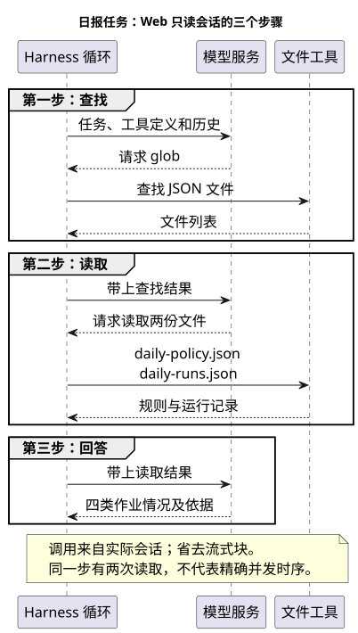

# 第 3 章：一次任务背后，DSH 是怎样工作的

日报已经生成了。现在暂时不增加功能，回头看刚才的过程：你只发送了一段话，界面却先出现文件查找、两次读取，最后才显示报告。谁决定调用这些工具？文件内容怎样进入下一次请求？换一个插件，会改变其中哪一段？

弄清这些问题，后面安装插件和排错就不必靠试。我们仍然使用上一章的日报，不换例子。

## 3.1 一次发送，为什么经历了三个步骤

在只读会话中，模型先提出 `glob` 调用，查找工作区里的 JSON 文件；收到查找结果以后，提出两次 `read`，分别读取规则和运行记录；得到文件内容后，生成日报。这一轮在界面中显示为三个步骤。

这里的“一轮”是读者发出任务到本轮结束的过程。“一步”是默认循环中的一次处理阶段。本例中每一步都向模型请求了输出，但工具的数量不等于步骤数量：第二步包含两次读取。

下图省去了流式文字块，只保留决定任务怎样往前走的交互。



图中的箭头需要分两种理解。模型到 Harness 的箭头，是请求执行某个工具；Harness 到文件工具的箭头，才是本地执行。模型并没有绕过 Harness 直接读取磁盘。

两次读取出现在同一个步骤，也不能仅凭这张图判断磁盘操作完全并行。图表达的是调用归属与结果依赖，不是线程调度。重要的是：形成最终回答时，两份材料已经通过工具结果进入了后续请求。

上一章命令行实验直接读取两个已知文件，没有先查找。这说明“先 glob 再 read”不是固定流程。模型可以选择不同路径，验收仍然围绕同一件事：它有没有获得正确材料，是否按规则判断。

## 3.2 循环做了模型没有做的工作

如果只调用一次模型接口，收到工具调用后就把响应打印出来，读者看到的会是一个操作请求，而不是作业日报。还需要程序接住它，执行读取，将结果整理为模型能够继续处理的消息，再发起下一步。

负责这件事的就是 Agent 循环。循环需要知道本轮任务、当前步骤、可用工具、会话历史以及取消信号。在固定版本的默认实现里，构建请求的代码如下：

```ts
const { request, preparedCall } = await this.buildRequest(
  turn, step, assembly.tools, system, this.session.deriveMessages(), signal,
)
```

先看三个实用的参数。`assembly.tools` 是本次组装出来的工具定义；`system` 是系统提示内容；`deriveMessages()` 提供会话推导出的历史。它们共同决定模型本次看到了什么。模型返回同一个工具名称，也可能因为参数、工作区或执行策略不同而得到不同结果。

`signal` 则用于把取消向下传递。用户点击停止时，不能只让按钮恢复正常，还要让正在等待或执行的工作有机会结束。具体工具是否及时响应取消，要看它的实现；这也是以后写插件时不能丢掉取消信号的原因。

默认循环在接收流式结果时把块追加到会话。读取工具完成后，调用及结果也会留下记录。下一步构建请求时使用更新后的历史，因此模型能够在查找之后读取、在读取之后回答。

这一段代码可在 [默认循环的 step 方法](https://github.com/deepseek-ai/deepseek-harness/blob/b150a551b8d465e31e418e1b2eaf5e79bbb7d28e/packages/core/agent-loop/src/agent.ts#L332) 中核对。先看 `buildRequest()` 的输入，再看流式结果写入会话的位置，就能把实现与图中的请求箭头对应起来。

## 3.3 DSH 的特别之处：循环也由插件提供

工具调用循环并非 DSH 独有。DSH 值得单独理解的地方，是它把构成 Agent 的多种职责交给插件装配。文件工具是插件，模型适配器和会话持久化实现也由插件提供，默认循环本身同样在插件体系中。

这与“主程序固定，插件只能增加几个工具”有区别。以后给日报助手增加一个能力，首先要判断它属于哪种职责。如果是检查作业记录，可以注册一个新工具；如果是观察用量，可以读取会话事件并形成统计；如果是更换文件执行环境，需要处理文件能力提供方。三个需求不必都改动模型请求循环。

拿读取文件来说，`tool-fs` 声明依赖：

```ts
export const inject = ['tools', 'fs', 'systemPrompt']
```

`tools` 用来贡献工具，`fs` 提供文件操作，`systemPrompt` 用于组织相应提示内容。读取工具负责解释路径、读取范围和输出形式；底层如何访问文件，则由文件服务承担。这种分工让工具不必把所有文件后端都实现一遍。

假如未来改成远程工作区，路径意义、权限执行位置和文件服务需要一起调整。不能因为它们是插件，就认为换一个包名即可安全运行。插件化提供的是可替换的位置，接口约定仍然存在。

还有一个容易忽略的分工：`core/agent` 提供接口和注册相关能力，`core/agent-loop` 提供默认驱动实现。循环插件还管理 Agent 的创建与清理。它卸载时要停止接收新工作，取消相关任务并等待清理，否则旧 Agent 可能继续引用已失效的服务。[Agent 工厂与生命周期实现](https://github.com/deepseek-ai/deepseek-harness/blob/b150a551b8d465e31e418e1b2eaf5e79bbb7d28e/packages/core/agent-loop/src/index.ts) 中的 `FactoryOwnership` 展示了这部分责任。

## 3.4 启动时，插件怎样接到一起

前面讨论的是发送任务以后。启动阶段还有另一条流程，负责决定这次启动究竟装入哪些能力。

启动命令中的 `--profile web` 选择一套具名配置。Profile 记录使用哪些 Bundle，以及自己的配置补丁。Bundle 是把一组相关配置变更一起分发的方式。加载器依次读取这些层，生成最终配置，再由 Cordis 加载插件、处理服务依赖与生命周期。

这些名字可以先按用途记：Profile 选择组合，Bundle 带来配置层，Cordis 让配置中的部件实际运行。安装包只是把代码放到可解析的位置，尚未完成后面的步骤。


图中的两个提示对应两种常见误判。配置树里出现某个插件，不代表它依赖的服务已经就绪；工具已经注册，也不代表当前调用获准执行。后者还要进入运行时的权限检查。

可以用下面的命令查看最终配置，但必须使用启动服务时同一个 Harness home：

```sh
dsh --profile web --dump-config
```

别直接公开整份输出，其中可能包含个人配置或敏感字段。

实现上，`loadProfile()` 把 Bundle 声明解析成配置层，`composeEntries()` 按顺序应用补丁，返回插件条目。如果某个包被列为 Bundle，却没有声明 `dsh.bundle.patch`，加载器会明确报错，而不是猜测应该加载哪个文件。[配置解析与组合代码](https://github.com/deepseek-ai/deepseek-harness/blob/b150a551b8d465e31e418e1b2eaf5e79bbb7d28e/packages/boot/app-boot/src/profile.ts#L358) 可以用来核对这种安装成功、加载失败的区别。

详细的目录与升级操作留到第 6 章。此处只要分清：启动装配决定有什么能力，运行循环决定本轮如何使用这些能力。

## 3.5 工具调用和操作成功之间，还隔着什么

我们在界面选择 Read Only，是在设置执行策略；任务文字中的“不修改文件”则是给模型的要求。两者不能互相替代。模型即使提出写入请求，执行环境仍应根据策略决定是否允许。

从调用请求到实际执行，中间还包括前置策略、守卫、执行包装，以及工具和底层能力的具体检查。下面保留第一版的执行流程图，用来辨认这些阶段。


这里的守卫可以理解为进一步检查执行条件的关口。不要把图里的所有阶段都理解成一个弹窗审批：有些检查在外层发生，有些来自工具内部。文件服务拒绝写入，与模型根本没有提出写入，是不同的情况。

第一版的只读写入实验确实出现过文件沙箱拒绝，随后独立检查确认探针文件不存在。这个案例的完整过程留到权限章节，本章不再重复截图。它说明一次调用可以被正常处理成错误结果，Agent 随后报告失败，本轮仍然正常结束。

因此，`turn/end` 的完成状态不能代替工具结果，更不能代替业务验收。在日报任务里，读取成功只说明拿到了材料，不保证报告中每句解释正确。

写观察插件时还要分清两类事件：`tools/pre-execute` 等复数形式是运行时扩展点，`tool/call`、`tool/result` 是会话中的调用事实。参与执行链的处理器可能影响操作是否继续；读取持久记录则是在检查已经发生的事情。不能把所有监听器都当成只读日志回调来写。

## 3.6 会话为什么不只是聊天存档

在第三步生成日报时，模型需要看到前两步的结果。默认循环从 Session 推导历史，而不是从页面上的聊天气泡提取文字。这意味着界面展示与模型历史是两个相关但不同的视角。

会话包含很多事件：流式块、步骤边界、工具调用、工具结果等。`deriveMessages()` 不会把每行记录都复制成一条消息，它从当前会话的消息节点形成模型历史。发生替换型上下文整理时，相应缓存需要重新推导，否则可能把已经替换的内容重新带回请求。[历史推导方法](https://github.com/deepseek-ai/deepseek-harness/blob/b150a551b8d465e31e418e1b2eaf5e79bbb7d28e/packages/core/session/src/index.ts#L726) 的输入是会话内部结构，输出才是下一次请求需要的消息。

这让“模型似乎没看到文件”变成可以继续检查的问题。先确认读取结果有没有保存，再检查它是否进入模型历史，最后核对实际请求。只盯着最终回答，会跳过中间的原因。

DSH 还有请求重建的不变量检查，用来比较循环生成的请求与会话推导出的内容是否一致。它检查的是特定循环请求的可追溯性，不承诺模型重跑时输出同样文字。模型服务、采样以及外部文件状态发生变化，回答仍然可能不同。

## 3.7 下一步应该固定哪一部分

回到日报。读取链路已经清楚：插件装配提供工具，循环驱动请求，文件结果进入会话，模型据此组织报告。接下来不需要先替换循环。我们要固定的是业务检查规则，让失败、缺失和超阈值的分类有确定实现。

下一章先把分类逻辑写成不依赖 Harness 的检查器。测试通过后，再把它接成插件。这样出现问题时，可以分别判断规则算错了，还是宿主接口接错了。

## 本章实验与参考材料

时序图依据第二版 Web 只读会话：`glob` 调用/结果序号 159/160，两次 `read` 调用为 241、242，结果为 243、244，均未报错。详见 [脱敏事件摘要](daily-readonly-evidence.json)。图不表示底层网络抓包或精确耗时。

配置图和工具处理图是固定源码版本的结构说明，原 PlantUML 保留在配套文件中；默认循环源码分析使用提交 `b150a551b8d465e31e418e1b2eaf5e79bbb7d28e`。此前请求不变量的 8 项构造测试通过，不能替代所有插件、远程后端或取消路径的端到端验证。这里集中列明范围，正文中的实际日报仍以官方包运行记录为依据。
