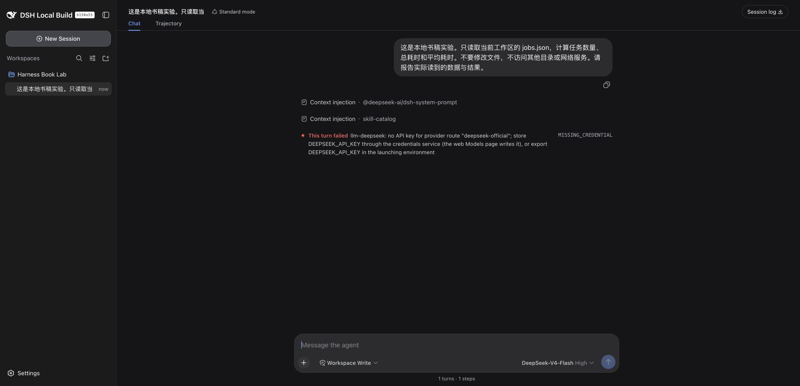
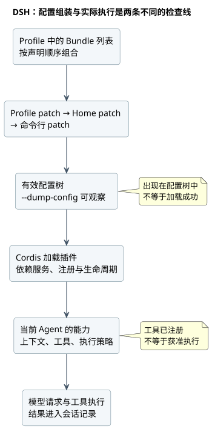
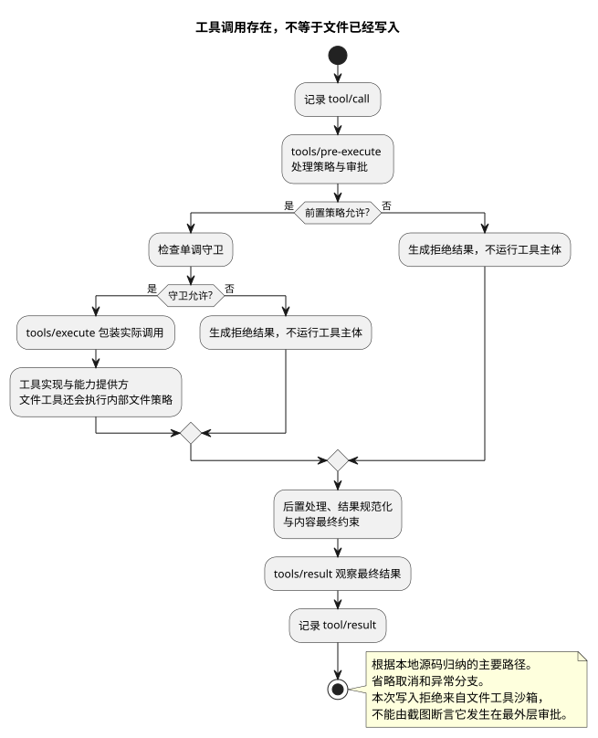
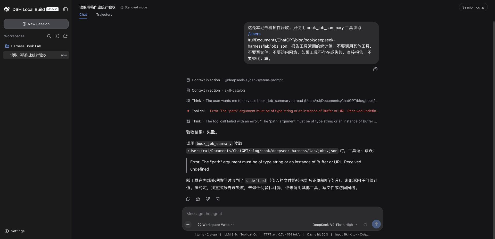
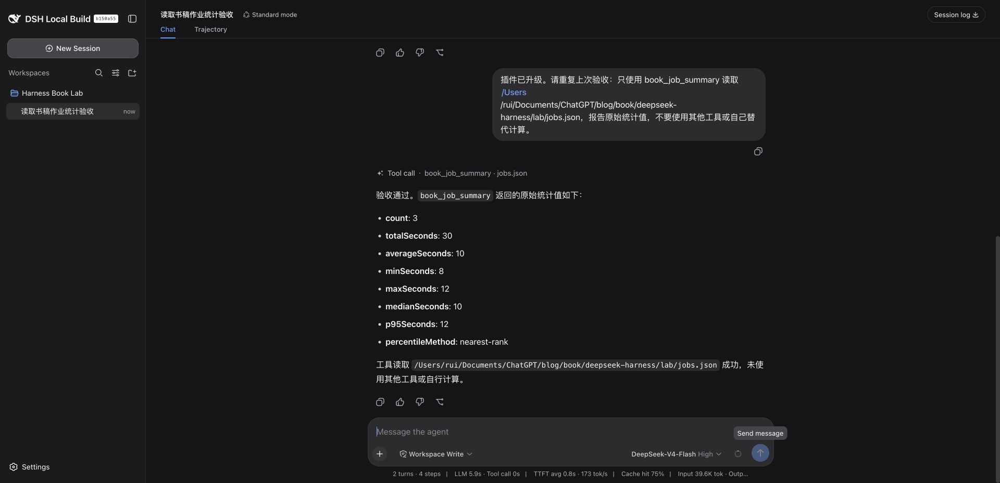
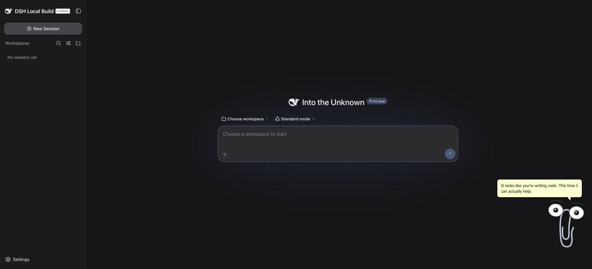
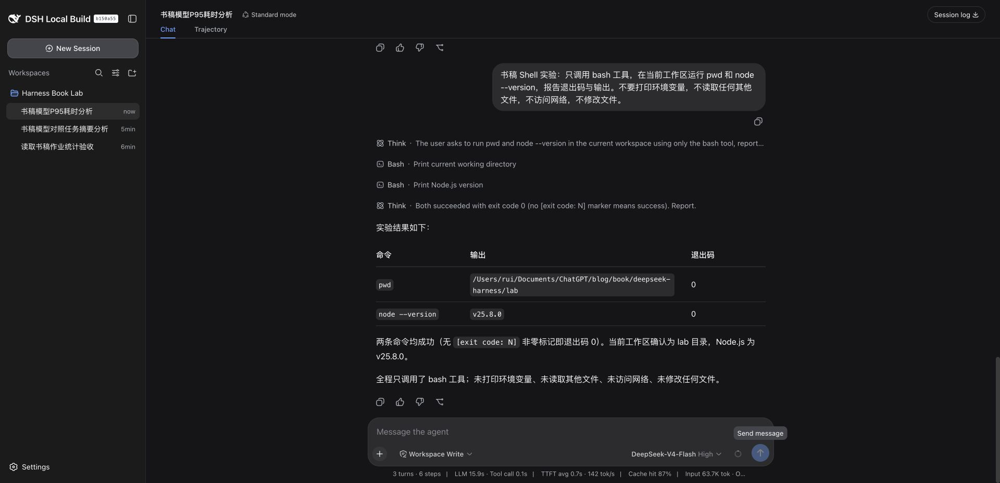
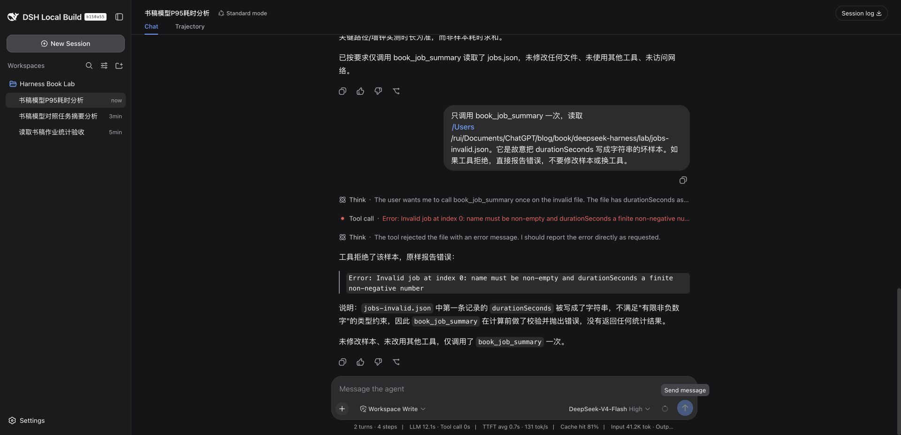

本版包括十章、真实操作截图、PlantUML 架构图、完整教学插件与社区案例索引。macOS 实测；未通过和未测试的范围在对应章节明确保留。不代表 DeepSeek 官方文档或正式出版物。

[下载 EPUB](deepseek-harness-guide.epub) · [下载教学插件](dsh-book-job-summary-0.1.1.tgz)

# 第 1 章：安装以后，先证明它真的完成了任务

我给第一次验收选了一个很小的任务：读三个作业的耗时，算数量、总和与平均值。它没有演示视频那么热闹，却容易检查。文件有没有读、数字有没有算对、是否误改文件，都能在模型之外确认。

这本书用的是 2026-09-08 的实验结果。官方包锁定为 `@deepseek-ai/dsh@0.1.1-rc.2`，本机 macOS，Node `v25.8.0`，pnpm `10.32.1`。这个组合是实验条件，不是最低版本要求，也不是所有平台的兼容承诺。后面分析源码所用的本地仓库还有桌面壳改动，因此我另外安装了官方 npm 包，独立完成第一次任务。

## 1.1 不先碰日常配置

我把安装目录、Harness home 和任务工作区分开：安装目录放程序，home 放 profile 与会话，工作区只放实验输入。三者混在一起，卸载插件时容易把任务文件也当缓存处理，截图时又容易带出凭据。

配套工程的 `runtime/` 不进入 Git。官方程序安装在 `runtime/official`，运行数据位于 `runtime/official-home`，任务样本在 `lab/`。读者可以换成自己的绝对路径，但同一次实验要始终使用同一个 `DSH_HOME`。

本次安装使用了锁定依赖的独立项目：

```json
{"private":true,"type":"module","dependencies":{"@deepseek-ai/dsh":"0.1.1-rc.2"}}
```

在这个目录执行 `pnpm install --ignore-scripts`。实际用时约 31 秒，安装 446 个包，出现 React peer dependency 警告。安装退出码为 0，但我没有把警告当作不存在；后面还要验证程序能启动、模型能调用工具。

此前一次 npm 安装长时间没有输出，我中止了它，再用 pnpm 完成安装。这只能说明本机当时的安装经历，不能据此断言 npm 不兼容。`--ignore-scripts` 也只是跳过安装脚本，运行程序时仍会执行包里的代码。

## 1.2 密钥和工作区各解决什么问题

密钥用于访问模型服务，不负责授予本地文件权限。反过来，给工作区写权限也不能修复模型鉴权失败。第一次运行时，我确实碰到了 `MISSING_CREDENTIAL`：页面正常出现，任务却没有成功执行。



实验启动器从本机受控文件读取密钥，只通过环境传给子进程，不把值写进书稿或启动命令。配套 `tools/run-harness.mjs` 展示了这个做法，并对输出做了密钥字符串脱敏。脱敏不是万能的：截图、其他日志或第三方插件都可能另有输出，所以原始运行目录仍不能直接发布。

读者正常安装后可以用 `dsh --profile web` 启动 Web profile。本书为了并行保留隔离实验，使用不同 home 和端口；端口号没有业务意义。自动化时我还在服务停止后预置了实验工作区记录，避免反复弹出目录选择器。这不是一次“通过图形界面添加目录”的测试。


## 1.3 第一个任务不要依赖模型自我评价

`lab/jobs.json` 包含三个 `durationSeconds`：12、8、10。提示语要求读取文件、汇总，不修改文件、不调用网络工具。原始任务在只读模式下完成；随后官方包的独立任务也保存了 `glob` 与 `read` 两次调用及成功结果。

正确结果是数量 3、总和 30 秒、平均值 10 秒。可以用下面的独立命令验算，而不是再问同一个模型“你确定吗”：

```sh
node --input-type=module -e 'import fs from "node:fs"; const x=JSON.parse(fs.readFileSync("lab/jobs.json","utf8"));const total=x.reduce((s,r)=>s+r.durationSeconds,0);console.log({count:x.length,totalSeconds:total,averageSeconds:total/x.length});'
```

命令从书稿目录执行。这里的“总和”只是观测耗时相加，不能直接说成整批并行作业用了 30 秒。第 6 章会看到，即使工具数字正确，模型也可能在这个解释上犯错。

## 1.4 怎样才算首次启动通过

我的验收有三层：页面能打开；会话中确实发生文件工具调用；结果与独立计算一致。只看到聊天气泡不够，模型可能根据提示猜出数字。只看到 HTTP 成功也不够，工具执行仍可能失败。

官方包独立成功会话的标识是 `session-5757be1e-8316-4f13-9341-ad2d6eeef6df`。脱敏事件索引在 [实验汇总](evidence/experiments.json)，不包含模型密钥和完整推理文本。它是事件证据，不是服务端 HTTP 抓包。

如果第一次失败，先判断停在哪一层：程序没有起来，查启动输出；页面正常但报鉴权错误，查模型凭据；工具报路径错误，查会话工作区和文件是否存在；数字不对，再查输入和计算。不要在同一次排查里同时换模型、重装插件、放开权限，否则恢复后也不知道是哪一步起作用。


# 第 2 章：DSH 如何工作——插件如何组成一个 Agent

在界面里输入“读一下文件”，很容易把接下来发生的事情理解成模型读文件、模型算结果。实际执行时，模型并不能直接打开我的磁盘。它先提出工具调用，由 Harness 决定如何执行，再接收工具返回的内容。

这个过程本身并不是 DSH 独有的。我们要研究的是另一件事：在 DSH 里，负责组织这段过程的部件，也由插件装配起来。文件工具是插件，模型适配器是插件，保存会话记录的实现是插件，默认 Agent 循环同样是插件。

理解这一点，才能解释不少看似矛盾的故障：包已经装好，工具却没有出现；工具已经出现，操作却被拒绝；页面恢复了聊天记录，重新执行的结果却不相同。本章沿着一次真实读取任务，逐层看这些区别。

> 本章实验日期为 2026-09-08，环境为 macOS、Node v25.8.0，使用 `0.1.1-rc.2` 本地构建，源码提交 `b150a551b8d465e31e418e1b2eaf5e79bbb7d28e`。本地桌面壳有未提交改动，不代表干净的官方安装。正文区分实际执行、源码分析和未通过的验证；文末列出证据入口。

## 2.1 先看一次真正发生的调用

实验目录中只有一份简单的任务样本。这里的数据是人为构造的，不是生产日志：

```json
[
  {"name": "orders", "durationSeconds": 12},
  {"name": "products", "durationSeconds": 8},
  {"name": "customers", "durationSeconds": 10}
]
```

我让 DSH 实际读取 `jobs.json`，计算任务数量、总耗时和平均耗时，并明确要求不改文件、不调用网络工具。会话使用 Read Only 模式，界面选中的模型为 DeepSeek-V4-Flash，推理级别 High。

结果是 3 个任务、总耗时 30 秒、平均每个任务 10 秒。这里不需要复杂的评分系统，在 Harness 外用 Node 读取同一文件就能独立验算。更重要的是，DSH 并没有直接给出这三个数：它先调用 `glob` 找到文件，再调用 `read` 读取内容，然后才回答。


这张图说明界面确实显示了结果，但仅靠截图，还不能排除模型根据对话猜答案。我进一步检查了隔离实例保存的会话事件，找到两组对应的 `tool/call` 和 `tool/result`。`read` 的结果中确实有样本文件的五行内容，且 `isError` 为 false。

这一轮的事件可以缩成下面这张表。序号来自本次会话，不是为讲解编造的编号。

| 事件序号 | 内容 | 可以确认什么 |
| --- | --- | --- |
| 23 | `turn/start`，turn 2 | 第二轮任务开始 |
| 25 | `step/start`，step 1 | 开始第一个步骤 |
| 113、114 | `glob` 调用与结果 | 找到了 `jobs.json` |
| 116 | `step/start`，step 2 | 开始第二个步骤 |
| 170、171 | `read` 调用与结果 | 实际返回文件内容 |
| 173 | `step/start`，step 3 | 开始第三个步骤 |
| 513 | `turn/end`，completed | 该轮正常结束 |

为什么从 turn 2 开始？此前有一次未配置凭据的失败请求。旧记录没有被清掉，因此页面当时显示总计 2 turns、4 steps，其中一个步骤属于此前的失败。本次成功任务本身是三个步骤。


这先纠正一个容易影响排错的认识：一次发送不等于一次模型请求。模型提出工具调用后，Harness 需要执行工具，并把结果交给后续步骤。这个实验里是三步，但不是任何读取任务都必须三步；模型也可能直接读取已知路径。

## 2.2 DSH 的特点，不在于多装几个工具

如果插件只负责提供几个外部工具，那么 Agent 的请求流程通常仍由主程序固定控制。DSH 的设计把更多职责交给插件：连负责驱动步骤、创建和恢复 Agent 的实现，都在 `packages/core/agent-loop` 中。

这改变了扩展时首先要问的问题。我要增加一个行为，先找它应该参与的服务或事件，而不是先去主循环里加分支。给模型提供一个工具、观察工具结果、替换 Shell 的执行实现，是三个不同的扩展位置，不应该都塞进同一段代码。

当前源码中，`core/agent` 与 `core/agent-loop` 也不是同一件东西：前者承担 Agent 接口和注册等职责，后者提供默认的驱动实现。把接口与实现分开，才有讨论替换实现的空间。**可替换不等于任意实现都兼容**，会话事件、取消和清理等约定仍然要满足。本章没有替换默认循环，不能把架构允许的能力当作已做过的实验。

这套设计也有成本。扩展点多了，故障可能来自配置、依赖、作用域或生命周期，不能看到“插件不可用”就一律重新安装。我认为学习 DSH 最有用的起点，是先把这几层分开，而不是背下全部插件名字。

这里需要把两个时间点分开。启动阶段负责把能力装配好：文件服务是否存在、工具能否注册、默认循环由谁提供。发送任务以后，才进入运行阶段：从会话构建请求，等待模型输出，执行工具，再决定是否继续下一步。前者出错，常见表现是能力根本没有出现；后者出错，才会看到某次调用失败或某轮执行中断。

默认循环插件还负责 Agent 的生命周期。它内部的 `FactoryOwnership` 会追踪已经创建的 Agent 和尚未完成的启动工作；开始卸载时，先停止接受新工作，发出取消信号，再等待清理。如果只从界面移除插件，却让旧 Agent 继续使用它，后续请求就可能访问已经失效的服务。

这部分可在 [Agent 创建与清理实现](https://github.com/deepseek-ai/deepseek-harness/blob/b150a551b8d465e31e418e1b2eaf5e79bbb7d28e/packages/core/agent-loop/src/index.ts) 中核对，重点看 `FactoryOwnership.dispose()` 的执行顺序。理解本章不需要先读完整个文件。

## 2.3 启动时，哪些插件被装进来了

先看实际组装结果。对书稿的隔离实例，我运行了构建好的 CLI，指定相同的 `DSH_HOME` 和 web profile，再使用 `--dump-config`。读者使用已安装的 CLI 时，对应入口是：

```sh
dsh --profile web --dump-config
```

要注意使用同一个 Harness home；否则查的是另一套配置。配置输出还可能包含自己填入的服务地址或敏感字段，分享前应检查，不要直接把整份输出贴进公开讨论。

本次输出中能看到 `session-persistence-jsonl`、`tool-fs`、`tool-fs-search` 等条目。有些条目的来源注释同时标出了基础包和 Web 包：它们不只是“来自某个包”，还被后续组合层修改过。

这里涉及四个概念：

| 名称 | 在本章中如何理解 |
| --- | --- |
| 插件包 | 已经分发到本机、可被解析的代码 |
| Bundle | 声明一组配置补丁，把相关能力一起加入或修改 |
| Profile | 一套具名组合，记录使用哪些 Bundle 和自己的配置 |
| Cordis | 根据配置加载插件，处理服务依赖、事件和清理 |

`loadProfile()` 会读取 profile 声明的 Bundle 列表，逐个解析包路径，再查它的 `dsh.bundle.patch` 声明。一个包即使存在，如果被当成 Bundle 使用却没有对应声明，加载器也会报错。它不会猜“也许这是另一种插件格式”然后继续。

这解释了为什么不能把“npm 能安装”当作“DSH 能加载”的证据。包管理器主要解决依赖和文件，加载器还要理解包如何进入配置树。



配置层还存在顺序。Bundle 按 profile 的声明顺序组合，之后叠加 profile、home 和命令行的补丁。排查配置不生效时，要检查最后结果，不能只看最早写下的那份文件。尤其不要默认每个配置对象都按字段深合并；补丁的具体替换语义要看实现。

把这段加载过程写成输入与输出，会更清楚：`loadProfile()` 接收 profile 名称、安装位置和 Harness home，返回解析后的配置层；`composeEntries()` 再把这些补丁按顺序应用到空配置树，得到最终的插件条目。到这里得到的仍然是“准备加载什么”，并不是“所有服务已经工作正常”。

例如，一个包下载到了磁盘，但未列入当前 profile，它不会因为文件存在就自动生效。另一个包已经列入 profile，却缺少 `dsh.bundle.patch` 声明，加载器会在读取配置层时直接报错。这两种情况都发生在模型请求之前，换模型解决不了它们。

[配置层解析与组合实现](https://github.com/deepseek-ai/deepseek-harness/blob/b150a551b8d465e31e418e1b2eaf5e79bbb7d28e/packages/boot/app-boot/src/profile.ts#L358) 展示了上述输入输出和缺失声明的检查；[配置输出实现](https://github.com/deepseek-ai/deepseek-harness/blob/b150a551b8d465e31e418e1b2eaf5e79bbb7d28e/packages/boot/app-boot/src/index.ts#L379) 则用于核对命令输出。本节检查了实际组装结果，配置覆盖顺序的说明来自源码分析，尚未做逐层覆盖实验。

## 2.4 一个 read 工具背后有哪些协作

这次任务用到了 `read`。它所在的 `tool-fs` 插件明确声明依赖：

```ts
export const inject = ['tools', 'fs', 'systemPrompt']
```

这三个依赖分别与注册工具、访问文件能力、组织提示内容有关。文件工具不是直接把所有实现包起来，而是使用 `ctx.fs` 提供的文件能力。读取实现中能看到 `ctx.fs.readText()` 和 `ctx.fs.streamText()`：小文件读取与大文件流式读取由这里选择，但底层文件能力由提供方负责。

这样拆分的意义，可以用一次改造来理解。假设以后文件来自远程执行环境，工具仍然需要处理路径参数、读取范围和输出格式，这些职责并没有消失。变化的是文件能力的实现。把两者分开，可以减少针对每种后端复制一套工具的需要。

但不能据此说换一个配置就一定完成远程化。文件与进程是否处在同一个环境、路径如何解释、权限在哪里执行，都必须一起核对。本章的实际调用是本地读取，没有运行远程沙箱。

插件之间的合作也不仅是方法调用。需要观察一次工具执行，可以监听对应事件；需要贡献工具，通过注册表注册。当前 `register()` 实现返回移除注册的函数，并把注册交给作用域层的 effect 管理。插件卸载时能够撤销自己贡献的注册，靠的是这种生命周期管理，而不是简单删除 npm 包目录。

这并不表示卸载能撤销插件已经发送的网络请求，或恢复它已经写坏的文件。可清理的注册与外部世界的历史副作用，是两回事。

因此，排查 `read` 时可以沿着一条明确的关系往下走：先确认 `tool-fs` 的依赖已经满足，再确认它把读取工具注册给当前作用域，最后检查文件服务是否接受路径并返回内容。工具名称存在，只能说明注册这一层可见，不能代替最后一步的文件访问验证。

需要进一步核对时，[tool-fs 初始化代码](https://github.com/deepseek-ai/deepseek-harness/blob/b150a551b8d465e31e418e1b2eaf5e79bbb7d28e/packages/fs/tool-fs/src/index.ts#L19) 说明它依赖哪些服务；[read 实现](https://github.com/deepseek-ai/deepseek-harness/blob/b150a551b8d465e31e418e1b2eaf5e79bbb7d28e/packages/fs/tool-fs/src/read.ts#L136) 说明它怎样读取文件；[工具注册表](https://github.com/deepseek-ai/deepseek-harness/blob/b150a551b8d465e31e418e1b2eaf5e79bbb7d28e/packages/core/tools/src/index.ts#L1037) 说明注册怎样随作用域清理。三份代码分别回答三个问题，不必一次通读。

## 2.5 调用已经出现，为什么操作仍可能被拒绝

成功读取后，我保持 Read Only 不变，让 DSH 只尝试一次 `write`：在实验工作区创建 `permission-probe.txt`，内容为 `harness-book-probe`。请求明确要求一旦拒绝就停止，不升级权限，不换 Shell 或路径。

界面出现 Write 调用，结果是：

```text
Error: [sandbox: file access denied under read-only mode]
```


这是工具调用后的拒绝，不是模型只用文字说“我不能写”。我又在 Harness 外检查探针文件，结果是不存在。持久事件 646 记录了 `write`，647 的工具结果为 `isError: true`，没有第二次工具调用。

还有个容易漏看的细节：这一轮的 `turn/end` 仍然是 `completed`。它表示 Agent 已经完成本轮处理并向用户报告拒绝，不表示写文件成功。只统计“轮次正常结束”的数量，会把这种工具失败也混进去。评测时必须同时看工具结果和目标文件。

沿着源码看，工具执行不是一次裸露的 `execute()` 调用。前置事件能给出允许、拒绝或询问决策；允许后还要经过守卫；随后进入执行包装、工具实现和后续处理。工具内部也可能有更具体的权限检查。这次报错指向文件沙箱，不能单凭截图把它说成最外层审批拦截。



这里有两组很像的名称，写插件时必须分清：

| 名称 | 用途 |
| --- | --- |
| `tools/pre-execute`、`tools/execute`、`tools/post-execute` | 运行时扩展点，参与调用处理 |
| `tools/result` | 观察最终结果的运行时通知 |
| `tool/call`、`tool/result` | 保存在会话中的调用与结果事件 |

复数 `tools` 与单数 `tool` 不是拼写随意。一个描述处理过程，一个记录会话事实。最终结果观察者也不应该被当成继续任意改写结果的地方。

有些事件采用 waterfall 方式串接。监听器若需要把处理交给后续逻辑，要调用 `next()`；不调用就可能截断链路。因此，“我只是装了一个观察插件，为什么原功能不执行了”不能只查插件有没有抛异常，还要查它是否正确委托。

同样，不能把所有事件监听器都写成 waterfall。事件类型和调用约定要对应，不能看到名字以 `agent/` 开头就照抄一段模板。

如果要从代码复查这次拒绝，应先读 [工具执行准备过程](https://github.com/deepseek-ai/deepseek-harness/blob/b150a551b8d465e31e418e1b2eaf5e79bbb7d28e/packages/core/tools/src/index.ts#L1463)，辨认哪些阶段发生在工具实现之前；再读 [调用与结果的会话记录过程](https://github.com/deepseek-ai/deepseek-harness/blob/b150a551b8d465e31e418e1b2eaf5e79bbb7d28e/packages/core/agent-loop/src/tool-calls.ts#L261)，理解失败为何仍会留下成对记录。本次文件沙箱拒绝只是其中一条实测路径，不能据此判断所有工具都受到相同约束。

## 2.6 会话记录为什么参与下一次请求

在这次成功任务中，第二步能读到第一步定位的结果，第三步能依据第二步的文件内容回答。去看默认循环的 `step()`，它构建请求时调用了：

```ts
const { request, preparedCall } = await this.buildRequest(
  turn, step, assembly.tools, system, this.session.deriveMessages(), signal,
)
```

这行调用的重要之处在于，历史不是从页面上的聊天气泡重新拼出来，而是从 Session 推导。界面与模型使用的数据有联系，但两者不是同一个展示列表。

`deriveMessages()` 也不是把日志每行都塞给模型。当前实现沿着 session surface 中的消息节点进行投影。轮次边界和流式块并不自动变成独立的对话消息；发生替换型的上下文整理时，推导缓存也要重建。否则越运行越重复，旧内容还可能被错误带回来。

这对排错很有用。用户说“模型像是没看到工具结果”，我们可以继续问：结果是否写入了会话？它是否属于模型历史的投影？请求头和工具定义是什么？问题不必停留在“这个模型不聪明”。

本次持久记录中的 `tool/result` 通过 `sourceEventSeqs` 指回调用事件。例如读取结果 171 指向调用 170。核对时不要只按相邻两行猜配对，应该使用记录中的关联信息。

DSH 还提供了请求重建的不变量检查插件。其源码把循环构建的请求与 `deriveMessages()`、折叠后的请求头比较；无日志来源的消息、模型配置或工具定义不一致，会触发检查。这个检查针对带循环标记的请求，不能扩大成任何第三方请求都受它保护。

我运行了对应的 `invariant.spec.ts`，8 项测试通过。其中包括给请求增加一条没有写入日志的消息、改动模型字段等反例。这些是构造测试，不是对模型服务端收到的 HTTP 请求逐字抓包。本次真实任务另有会话记录和界面结果，两种证据各自说明不同的事情。

还要避免另一个误解：能重建请求，不等于再调用一次必然得到同样回答。模型版本、采样、外部文件状态和工具环境都可能变化。会话日志让差异更容易核对，并不会消除这些变量。

这也解释了会话记录在 DSH 中为什么不只是聊天存档。下一次请求需要从它恢复模型可见的历史，诊断工具又需要用它检查实际请求是否有据可查。记录缺失，可能影响后续行为；界面少显示一项，则未必表示模型也没有收到。两者必须分别检查。

实现上的对应关系是：[循环的请求构建](https://github.com/deepseek-ai/deepseek-harness/blob/b150a551b8d465e31e418e1b2eaf5e79bbb7d28e/packages/core/agent-loop/src/agent.ts#L332) 消费历史，[Session 的历史推导](https://github.com/deepseek-ai/deepseek-harness/blob/b150a551b8d465e31e418e1b2eaf5e79bbb7d28e/packages/core/session/src/index.ts#L726) 提供历史，[请求不变量检查](https://github.com/deepseek-ai/deepseek-harness/blob/b150a551b8d465e31e418e1b2eaf5e79bbb7d28e/packages/core/agent-loop/src/invariant.ts) 比较两者是否一致。读源码时沿着这个方向，比按目录顺序阅读更容易理解。

## 2.7 用这套结构判断问题发生在哪里

回头看实验中的第一次失败：界面能启动，模型名称也存在，系统上下文已经注入，但轮次结束原因是 `MISSING_CREDENTIAL`，没有成功的文件工具调用。

这时去修改 JSON 内容或给工作区增加写权限，没有针对已经观察到的失败。凭据配置后重新发送任务，才出现 `glob`、`read` 和正确汇总。由于第二次的提示语和会话状态也有变化，这不是严格的单变量性能实验；它能确认的是凭据错误消失，真实文件读取成功。

再看只读写入实验：已经出现 `write` 调用，结果明确拒绝文件访问。此时模型接入显然不是第一排查对象，应该检查执行策略。把错误发生的阶段找准，比反复换模型有用。

面对社区问题，可以先用这张短表决定查哪里：

| 观察到的现象 | 先检查什么 | 不应该立即下的结论 |
| --- | --- | --- |
| 安装命令失败 | 依赖解析、包路径、包管理器环境 | 插件业务逻辑有 bug |
| 包存在，配置树没有它 | profile 与 Bundle 声明 | 模型不会调用工具 |
| 配置树有它，服务没就绪 | 加载错误与依赖 | 重新下载就能好 |
| 工具调用出现，结果拒绝 | 策略、审批、工具内部检查 | 文件已经发生修改 |
| 工具结果正确，回答不对 | 历史投影、实际请求与模型回答 | 文件读取失败 |

社区投稿中，旧 `file:/tmp/…tgz` 引用导致安装新插件时报错，就是第一类线索。报错由安装新插件触发，根因却可能是旧依赖已经失效。这个案例由 [pbni-132 报告](https://github.com/deepseek-ai/deepseek-harness/discussions/1477#discussioncomment-18311978)，本书后续用构造的坏引用复现了同类机制，过程见第 4 章。

## 2.8 测试失败以后，我只改了模块解析顺序

源码中的工具注册表支持作用域，设计意图是让不同 Agent 使用各自的工具集合。然而，我在本地运行 `scoped.spec.ts` 时，27 项中有 14 项失败。失败包括工具可见范围和作用域内拦截等断言。

随后检查工作区，发现部分源码目录同时存在 `.ts` 和生成的 `.js`。我没有删除这些文件，也没有修改宿主实现，而是在书稿目录建立独立 Vitest 配置，把 TypeScript 扩展名放在解析顺序前面，再运行同一组测试。结果是作用域 27 项、请求不变量 8 项，合计 35 项全部通过。

这组对照把问题缩小到了本地模块解析与构建产物混用。源码里的作用域依赖模块内的 Symbol 和映射表；加载两份实现会影响身份判断。不过本次没有完整记录解析器加载的全部路径，所以我不把“双份模块”写成已经逐一证明的最终根因。能够确认的是：同一源码、同一测试集，优先解析 TypeScript 后失败消失。配置保存在 `tools/vitest-source-only.config.mts`，没有覆盖原仓库配置。

本章已经验证配置输出、真实读取、只读写入拒绝和上述 35 项构造测试。构造测试通过不等于完成了多 Agent 生产隔离审计；替换默认循环、远程能力实现和 waterfall 误用也没有在这里实测。另用官方 npm 的同版本包完成了独立读取任务，见第 1 章，避免全书只依赖带本地改动的构建。

## 实验材料与继续阅读

- [事件提取与独立验算脚本](tools/summarize-session.mjs)：只导出事件结构，不导出完整提示词、推理内容或密钥。
- [本次验证记录](evidence/02-validation.md)：命令、通过与失败范围。
- [本次事件摘要](evidence/02-session-summary.json)：由隔离会话自动提取。
- [社区案例台账](community/cases.md)：保留投稿署名和复测状态。
- [固定提交的架构文档](https://github.com/deepseek-ai/deepseek-harness/blob/b150a551b8d465e31e418e1b2eaf5e79bbb7d28e/docs/architecture.zh.md)：用于查阅术语和其他扩展入口。

读到这里，再遇到“装了插件但没反应”，应该能先提出几个具体问题：代码有没有装到当前 profile？加载器有没有接受它的声明？需要的服务是否存在？当前 Agent 是否使用它？调用究竟停在了哪一步？下一章就沿着这些问题，实际检查一个插件从安装到生效的全过程。


# 第 3 章：插件为什么装上了，却没有生效

“安装成功”是包管理器的结论，不是 Agent 的验收结论。本次原创插件的第一版就证明了这一点：包能安装，工具能出现，单元测试也通过，真正调用却失败。

先把加载链路弄清楚，才能区分这个失败究竟发生在哪里。

## 3.1 Manifest 里要看什么

本书示例是 ESM 包，入口为 `index.js`。`package.json` 中与 DSH 组合直接相关的是：

```json
{
  "name": "dsh-book-job-summary",
  "version": "0.1.1",
  "type": "module",
  "main": "index.js",
  "dsh": {"bundle": {"patch": "cordis.patch.yml"}}
}
```

完整文件在 [示例目录](examples/job-summary/package.json)。这段不是完整可发布 manifest 的替代品；许可证、打包白名单等还在原文件里。

补丁文件把插件加入配置树：

```yaml
- insert:
    - id: book-job-summary
      name: dsh-book-job-summary
```

包名用于解析代码，配置节点 id 用于识别树中的条目，工具名 `book_job_summary` 则是提供给模型的调用名称。三个名字职责不同，搜索日志时不能只搜其中一个。

## 3.2 装到了哪个 profile

实际实验先在示例目录执行 `npm pack --ignore-scripts`，再把本地产生的 tarball 加到隔离 Web profile：

```sh
dsh plugin --profile web add /absolute/path/dsh-book-job-summary-0.1.1.tgz
dsh --profile web --dump-config
```

执行前设置自己的 `DSH_HOME`。如果启动服务和安装命令使用了不同 home，即使两边都叫 web，也不是同一份配置。

检查最终配置中有没有 `book-job-summary`。没有，继续查安装目标与 Bundle；有，继续查加载和依赖。不要在这一步就修改模型提示词。`--dump-config` 可能带出个人配置，公开求助前必须脱敏。

本次插件声明 `inject = ['tools', 'fs']`，注册一个工具，并使用宿主文件服务。不是每个插件都会给模型增加工具：Clippy 增加的是界面与会话状态展示，Usage 增加的是统计投影和设置页。用“工具列表里有没有它”验收所有插件，会误判。

## 3.3 加载成功仍然可能调用失败

第一版 `0.1.0` 的真实调用返回：

```text
The "path" argument must be of type string or an instance of Buffer or URL. Received undefined
```



这时安装层已经不是第一嫌疑：模型确实调用到了工具，异常来自执行过程。后来发现我把字符串直接传给 `ctx.fs.readText()`，而宿主接口接收的是 `FsTarget`。正确过程是先 `resolve()`，再 `readText()`。第 9 章会展开这次错误，尤其是为什么 15 项单元测试没有挡住它。

修复后升级到 `0.1.1`，重启同一隔离服务，再发送任务，真实结果通过。没有因为第二版成功就删掉第一版记录，它恰好是理解加载边界最直接的材料。

## 3.4 排查时只问下一层的问题

包目录不存在，查安装；包存在但配置没有节点，查组合声明；节点存在但服务缺失，查依赖和加载输出；调用发生但抛错，查执行接口；工具成功但回答错误，查结果进入模型后的解释。

这些阶段不是一份错误码大全，而是缩小范围的方法。社区速报中的 `prepare undefined`、客户端依赖加载失败，都应先还原所在阶段，再核对宿主与插件版本。历史报错文字相似，不表示今天的根因一定相同。


# 第 4 章：安装、升级和卸载，为什么会牵连其他插件

安装一个新插件，却提示另一个旧包不存在，这并不矛盾。包管理器处理的是当前依赖集合，不只是命令最后写下的那个包。

社区用户 [pbni-132 的投稿](https://github.com/deepseek-ai/deepseek-harness/discussions/1477#discussioncomment-18311978) 提到，历史依赖还指向临时目录中的 tarball，安装新插件时因此触发 `ENOENT`。我在隔离 home 中构造了同类失效引用，实际运行安装命令复现了失败。

## 4.1 临时包不是长期依赖仓库

实验在一个专用 profile 的依赖声明里放入已不存在的本地 tarball 路径，然后安装本书示例插件。安装退出码为 254，错误指向那条失效路径。新插件自己的文件存在，也不能让整个解析过程跳过坏依赖。

我只移除了这个人为构造的坏依赖，再执行同一安装动作，退出码变为 0。这里复现的是“旧本地依赖破坏后续安装”的机制，不是逐字复制投稿人的全部桌面环境。原帖提到的其他版本信息仍按作者报告保留。

读者遇到类似问题，先检查报错实际指向哪个包，再检查当前 profile 的 `package.json`、锁文件和 Bundle 声明是否还引用它。若它仍在使用，优先恢复可信安装包；若确定弃用，再协调移除依赖和加载声明。不要直接清空整个 home，那里可能还有会话、凭据和其他插件配置。

## 4.2 本书实际做过的升级

原创插件 `0.1.0` 安装与加载成功，但真实调用失败；`0.1.1` 修正文件接口后重新打包，通过同一 `plugin add` 入口安装，再重启服务。修复后的真实调用返回 3、30、10 和 P95=12。



这个过程不能简化成“覆盖 index.js 就行”。包管理器处理的版本、磁盘上的代码、已经运行的进程，可能处于不同状态。我的验收包含新包版本和新请求结果；本书没有验证热更新，因此操作步骤明确保留重启。

为了可以回退，保留上一版归档有用，但不要让 profile 长期引用会被清理的临时路径。对发布包还应记录来源和哈希。回退也要跑原任务，不能只看安装输出。

## 4.3 卸载验收不是看一句 removed

在另一个隔离生命周期实验 home 中，我先安装示例，再执行：

```sh
dsh plugin --profile web remove dsh-book-job-summary
dsh --profile web --dump-config
```

卸载后检查依赖声明与最终配置，示例节点没有残留。检索命令“没有找到”时可能返回退出码 1，这在这里是预期结果，不是卸载失败。该实验没有删除任何日常 profile。

本例没有业务存储，卸载不涉及用户数据迁移。不能据此推断带数据库、缓存或远端账号的插件也会自动清理干净；卸载代码与删除业务数据本来就是两件事。

## 4.4 为什么本章不推荐一键清缓存

另一条 [pbni-132 投稿](https://github.com/deepseek-ai/deepseek-harness/discussions/1477#discussioncomment-18305715) 涉及 `ERR_PNPM_UNEXPECTED_STORE`。作者分析了上级工作区与 `.modules.yaml`。本书没有完成这条环境的独立复现，因此不把其中的清理步骤改写成通用修复命令。

可靠的排查记录应保留：操作目标、实际依赖路径、包管理器版本、失败前后唯一改动、修复后的真实调用。只有“重装后好了”，下一次同类故障仍然没有依据。


# 第 5 章：社区插件实际装起来，结果怎样

本章选了两个投稿插件：sjh9714 的 Clippy 和 kestiny18 的 Usage。前者让会话状态可见，后者统计模型用量。加上前面的作业汇总工具，构成一个小工作流：读数据、看执行状态、核对调用开销。

结果并不是三个功能都完全通过。原创工具能正确汇总；Clippy 能显示并响应状态接口，但动态事件表现没有完整验收；Usage 页面存在，统计却为空。把这些差别写清楚，比放一排安装命令更有参考价值。

## 5.1 下载之后，运行之前

我先用 `npm pack --ignore-scripts` 获取固定版本归档，检查 manifest、入口和关键实现，再装入专用 home。实际版本为 `dsh-clippy@0.2.1`、`dsh-usage@0.2.5`。投稿时的版本并不相同，不能把作者早期的测试结果直接套在今天的包上。

两个包安装时都有 peer dependency 警告。警告没有阻止安装，也不能因此忽略。后续实验只针对当前 macOS、Node v25.8.0、宿主本地构建 0.1.1-rc.2、Web profile。这里没有验证桌面发行版和 Windows。

安装脚本不是唯一风险点。插件启动后也能执行代码、监听事件或访问服务；`--ignore-scripts` 不会把第三方代码变成沙箱代码。

## 5.2 Clippy：界面出现，不等于事件全测过

来源：[sjh9714 的投稿](https://github.com/deepseek-ai/deepseek-harness/discussions/1477#discussioncomment-18024040)。我看到的实现由宿主状态服务和客户端展示组成，客户端轮询同源 `/api/clippy/state`，宿主侧监听会话事件并更新阶段。

实测中，页面能显示 Clippy，状态接口返回 HTTP 200 和 idle 状态。这同时验证了后端路由存在与客户端组件能渲染，不只是 npm 安装成功。



但本次没有逐个捕获思考、工具执行、失败、完成状态的转换。任务很短，空闲状态又会恢复，最后看到 idle 不能证明中间所有事件都正常。因此兼容表记为“部分通过”，而不是“完全兼容”。后续若专门测这个插件，应设计持续时间可控的任务，逐个检查状态与事件时间，而不是靠印象判断动画动过没有。

## 5.3 Usage：有 token，为什么还是空白

来源：[kestiny18 的投稿](https://github.com/deepseek-ai/deepseek-harness/discussions/1477#discussioncomment-18024567)。本次启动后设置页出现 Usage。我发送一个不需要工具的短任务，模型确实回答完成，会话底部显示输入 9,471、输出 80 token，Usage 页却仍提示调用后才会出现数据。重新加载页面也没有恢复。


下一步不应该立刻换密钥。持久会话中序号 100 的 `assistant/message` 已经有 `usage`，包括 `inputTokens=9471`、`outputTokens=80`。模型没有返回用量的假设，与记录矛盾。

我再把同一份事件交给插件导出的 `foldModelCostEvents()`，脱离页面执行统计。结果是一条请求、9,471 未缓存输入、80 输出，与会话一致。为了只验计数，独立试验使用零费率，输出的费用 0 **不是实际账单**。

这一步把排查范围缩小到统计注册、会话投影传播或客户端读取等连接环节，尚未定位最终根因。它不能证明每种事件都能正确统计，但能排除“这份会话完全无法被该统计函数处理”。我没有修改第三方代码来让截图好看，也没有把空白页写成已修复。配套 [重放脚本](tools/replay-usage.mjs) 与 [计数结果](evidence/usage-replay.json) 保留了这个检查；脚本需要本机私有实验日志，分发包不包含原始会话。

## 5.4 费用和社区同步需要单独验收

用量统计与实际扣费不同。计价依赖提供方、模型、缓存类别、费率生效时间。插件内置的价格表是配置，不是付款凭证；本书没有拿它核对账户账单，也不据此报价。

该插件还有社区同步能力。本次保持 Private、Never synced，没有连接 GitHub，也没有启用同步。源码中有按条件运行的同步逻辑，不能因为本地统计功能看起来无害，就替用户同意上传数据。

要把这套工作流用于日常，作业统计目前可继续使用；Clippy 属于展示功能的部分验证；Usage 尚不能充当本机可靠的费用看板。失败记录和版本条件都留在附录，升级后重测同一任务才有可比性。


# 第 6 章：模型算对了，解释仍然可能错

我原本以为这个实验主要会比较速度。实际更有价值的发现是：两个模型都拿到了正确工具结果，却都在解释时超出了数据允许的范围。

## 6.1 先把比较任务固定下来

使用新建的独立会话、同一个工作区、同一版 `book_job_summary`，推理级别均为 High，访问模式均为 Workspace Write。提示要求只调用这个工具，返回 count、totalSeconds、averageSeconds、p95Seconds，并解释总和为什么不是并行墙钟耗时、三个样本的 P95 有何局限。

本次各执行一次，模型是界面中的 DeepSeek-V4-Pro 与 DeepSeek-V4-Flash。没有声称锁定服务端内部权重版本，也没有做交替多轮采样。这是一次小型对照，不是性能榜单。

| 观察项 | Pro | Flash |
| --- | --- | --- |
| 四个数字 | 3 / 30 / 10 / 12，正确 | 3 / 30 / 10 / 12，正确 |
| 工具 | book_job_summary | book_job_summary |
| 界面该轮耗时 | 约 14 秒 | 约 9 秒 |
| 界面输入 | 约 19.5K token | 约 19.6K token |
| 界面输出 | 840 token | 958 token |
| 界面缓存命中 | 50% | 61% |

这些数来自当时 UI，不是独立网络基准。缓存条件不同，样本数又只有一，不能从中得出普遍的速度、成本或质量排序。


## 6.2 第一个错误：把最长任务当成整批耗时

两个回答都把最长的 12 秒推广成并行任务的墙钟耗时。只有进一步知道任务同时开始、没有额外等待等条件，这样的计算才成立。样本只给了各自耗时，没有开始时间或依赖关系。

一个假设反例就能检验这个说法：仍然是 12、8、10 秒，但三个任务分别在第 0、100、200 秒开始，最后一个在第 210 秒结束。从首个任务开始到最后结束，跨度为 210 秒。它们的耗时和仍然是 30 秒。这是教学反例，不是原样本的隐藏运行记录。

Pro 还把耗时求和描述成 CPU 或占用时间的总量。输入字段叫 `durationSeconds`，没有 CPU 计时定义，因此这个解释没有依据。若要算资源占用，需要资源数量及时间口径；若要算 CPU 时间，需要相应计量字段。

正确回答应停在数据边界：当前能够计算耗时分布，不能还原整批墙钟时长。这个边界比多写几句并行计算术语重要。

## 6.3 第二个错误：把估计不稳定说成无法定义

nearest-rank 的样本 P95 就是排序后第 `ceil(0.95*n)` 个值。n=3 时取第三个，所以是 12。这个计算定义明确，不要求样本中一定有恰好 5% 的值高于它。

真正的限制是：只有三个观测，用它判断生产总体尾延迟很不稳。一次异常就可能改变结果，样本如何采集、是否独立、是否覆盖高峰也都未知。“可计算”与“足以支持生产结论”不是一回事。

因此验收应该分成工具层和解释层：工具是否按约定计算；模型是否正确描述指标、没有补造时间轴或计量语义。本次工具层通过，解释层有错误。若只比最终答案里有没有 3、30、10，两个回答都会被误判为全部正确。

## 6.4 如何把一次对照变成可用评测

先确定几类任务：正常输入、坏输入、缺少信息、拒绝执行、长上下文后仍需保留的约束。每个任务写下可判定结果和不允许做的事，再记录模型标识、推理级别、插件版本、工具序列与用量。

需要比较时，重复运行并交替顺序，保留失败，不只挑最好的一次。任务成本还应包括重试和人工修正，不只是输出 token。没有真实重复样本，本书不填一张看似完整的均值和 P95 表。

本次坏输入任务另行实测：把 durationSeconds 写成字符串，工具拒绝，模型没有换工具绕过，也没有修改文件。它验证了一个失败场景，但不能替代长上下文、取消和多轮恢复等尚未测试的场景。


# 第 7 章：权限、Shell 和工作区，不是一回事

“只读模式下模型说写入失败”和“文件真的没有写入”，是两份需要相互核对的证据。我实际让它尝试写一个无害实验文件，工具拒绝后，又在 Harness 外检查文件不存在。

## 7.1 一次真正被拒绝的写入

目标是实验工作区内的 `permission-probe.txt`，不是个人文件。会话在 Read Only 下出现 write 调用，结果 `isError=true`，最终轮次却以 completed 结束。


这没有冲突：Agent 正常告诉用户失败，也可以算轮次完成。监控系统只统计 completed，会漏掉工具层拒绝。第 2 章的事件摘要保留了调用与结果关联，也记录了独立检查 `probeExists=false`。

这只验证了本地文件工具的一条路径，不证明所有第三方插件都无法绕过权限。一个插件如果直接使用 Node API，其行为不能自动等同于宿主文件工具的策略。安装第三方代码本身就是信任边界。

## 7.2 Shell 到底在哪运行

在 Workspace Write 模式下，我只要求 bash 执行 `pwd` 和 `node --version`，不读取环境变量、不联网、不改文件。两次工具调用成功，返回书稿 lab 的绝对路径和 `v25.8.0`。



这两个小命令适合先确认环境。终端里自己运行的 Node，与服务进程找到的 Node 未必一样。遇到 Windows 的 `/bin/bash`、MSYS2 退出码 127 等报告，应先确认宿主实际选中的执行实现和可执行文件，而不是把自己的交互式终端配置当作服务环境。

这里没有运行危险命令，也没有验证网络隔离。任务提示中的“不访问网络”是对 Agent 的要求，不等于操作系统已经限制所有进程出网。

## 7.3 原创工具的边界在哪里

示例工具要求会话有工作区，通过宿主 `resolve()` 解析工作区和目标，再用 `contains()` 检查包含关系，检查是普通文件且大小不超过 1 MiB，最后读取、解析和校验数据。

它不直接写文件，不调用网络。但仍有明确局限：路径入口只接受 POSIX 绝对路径；文件大小检查与读取之间有时间窗口；符号链接和远程文件实现还受提供方语义影响。本书没有做完整沙箱审计，不能给它贴“绝对安全”的标签。

读取前做大小检查，读取后再做字符数检查，可以挡住一些误用，不是严格的内存上限。若输入来自不可信来源，应使用真正受限的读取方式，并针对宿主文件服务的实际能力做测试。

## 7.4 求助日志也需要权限意识

不要为了确认模型配置而打印全部环境变量，也不要把完整 home 打包发到讨论区。请求头、提示、文件内容和第三方服务地址可能夹在日志里。

本书的导出脚本只保留事件类型、序号、工具名称、成功失败和计数等字段。原始压缩会话留在被 Git 忽略的 runtime。公开截图仍要人工检查，结构化日志的脱敏不能替代截图检查。


# 第 8 章：沿着一次失败找到问题所在

排查不是从最熟悉的组件开始猜，而是从最后一个确认成功的位置往后走。本书中发生的几次失败，恰好覆盖了不同层次。

## 8.1 单元测试全过，第一次调用就错

原创插件第一次运行报 path 收到 undefined。我先确认工具调用已发生，因此包加载与模型选择工具都不是当前阻断点。接着对照宿主 Fs 接口：`readText()` 接收 `FsTarget`，不是裸字符串。


第一版测试里的假 fs 接口也写错了，它接受字符串，于是错误实现与错误替身相互配合，15 项测试全部通过。修复不是只改生产代码：同时让测试替身要求正确目标对象，并验证 resolve、工作区检查和取消信号传递。然后再打包，安装到真实宿主执行。

修复后的同类任务成功。这条链路支持的结论是“接口使用错误已在该场景修复”，不是“15 个单元测试足以证明整个插件可靠”。

## 8.2 安装 A，错误却来自 B

第 4 章构造的旧 tarball 引用导致安装失败。只移除构造出的坏引用，安装恢复。这种错误首先查依赖集合和实际路径，而不是调试 A 的业务代码。

原始社区报告来自 [pbni-132](https://github.com/deepseek-ai/deepseek-harness/discussions/1477#discussioncomment-18311978)。本书把作者报告与控制实验分开，是因为“同类机制复现”不意味着已经拿到作者机器并验证了全部环境。

## 8.3 页面空白，先确认上游数据

Usage 的例子更适合练习排除法。页面空白；会话消息确实有用量；直接折叠这些事件也能统计。由此不能立刻指定某一行客户端代码为根因，但可以停止反复更换密钥和模型。

这里的“投影”需要先解释。会话事件记录的是一次次发生的事情，Usage 页面需要的却是累计请求数、输入 token 和输出 token。投影就是从事件中计算这些统计值的过程。它不需要再次请求模型；只要保存的事件足够完整，就能重新计算。

本次实际会话里，一条 `assistant/message` 记录包含 9471 个输入 token 和 80 个输出 token。把同一份会话交给插件的 `foldModelCostEvents()`，得到 1 次请求以及相同的 token 计数。因此至少有两件事已经成立：用量进入了持久记录，插件的折叠函数能识别这份记录。实验故意使用零费率，验证的是计数，不能拿结果当作实际账单。

但页面并不直接调用这个折叠函数读取磁盘。`dsh-usage` 0.2.5 的服务端先通过 `ctx.sessionProjections.register()` 注册统计单元；客户端设置页再从会话摘要的 `projectionValues.modelCost` 取值。离线计算成功，只检查了中间的计算逻辑，没有验证注册、传输和页面消费这一整段链路。

更值得注意的是空状态的含义。检查该版本的 `UsageSection` 后，可以把页面筛选条件概括为下面这段伪代码。它用于解释逻辑，不是可安装的插件代码：

```text
遍历会话摘要：
  找不到摘要或 modelCost → 不显示该会话
  请求数为 0，并且总 token 为 0 → 不显示该会话
  其余会话 → 加入统计列表

统计列表为空 → 显示“模型调用报告 token 后将出现用量”
```

所以这句提示并不能证明模型没有返回 token。缺少投影字段也会走到同一个空状态。若只根据提示文字继续换密钥、换模型，会反复验证已经确认正常的上游，而没有碰到真正未检查的部分。

下一次检查应在服务端投影快照和客户端会话摘要之间取证：若快照没有 `modelCost`，检查注册与回放；若快照有值而客户端摘要没有，检查传输和状态更新；若摘要已有非零计数，再检查页面筛选。每一步都应记录观察值，而不是同时改三个地方。

截至这次实验，最终断点仍未定位，也没有经过修复后的页面复测。这个案例目前教的是如何缩小故障范围，不能当作一份已解决问题的操作指南。读者可以用随书的 [会话用量重算脚本](tools/replay-usage.mjs) 核对计算方法，用 [脱敏后的重算结果](evidence/usage-replay.json) 对照上述计数；脚本使用本书隔离实验的本地会话路径，在其他机器运行前需要替换为自己的测试会话。

## 8.4 14 个失败，为什么没去改宿主

作用域测试第一次 27 项中 14 项失败。工作区同时存在源文件和构建产物，我用独立测试配置优先解析 `.ts`，原仓库不动，再跑相同测试，连同请求不变量共 35 项全过。

这个对照支持模块解析污染的方向，但没有逐个记录完整加载图。因此本书只保留得到证据的范围，不宣布官方版本工具隔离损坏，也不随意删除用户的生成文件。

## 8.5 把日报变成可以积累的案例

已归档的 2026-08-15 社区速报包含九条线索，涉及工具 prepare、加载失败、Windows 目录选择、Shell、浏览器安全上下文、上下文长度、视觉路由和配置解析。原链接与署名在 [社区台账](community/cases.md)。这些是线索，不是本书已经亲测的九个修复。

后续整理同类日报，值得保留的不是每天多少条，而是：现象、版本、最小复现、最后成功的位置、唯一变更、复测结果。相同根因再次出现，应追加环境差异，不必复制成一篇新故障。

例如 context length 400，应保留实际模型标识和请求长度证据；只有报错截图，没有上下文构成，不能直接归罪于“模型太小”。配置 unexpected token 则先核对文件字节、编码与解析入口，不应同时更换模型和 Shell。

本书不会编造尚未找到的其他日报。当前台账说明覆盖了哪一天、哪些原帖未逐条复核。这个缺口是公开的，不能用一张看似齐全的兼容表掩盖。


# 第 9 章：从零写一个作业耗时插件

这个插件只做一件事：读取工作区内的 JSON 作业样本，校验字段，返回确定的统计结果。计算交给代码，指标解释交给模型，二者分开验收。第 6 章已经说明为什么有必要这样分。

完整可运行源码在 [examples/job-summary](examples/job-summary/README.md)，没有需要读者自行补齐的伪代码。阅读版书末也附完整入口、统计实现和测试。

## 9.1 先定义数据语义

输入必须是非空数组，每项有非空 name 和非负有限数 durationSeconds。不把字符串 `"12"` 自动转成数字，以免上游数据类型问题被悄悄掩盖。重复名称视为多次观测，不去重；零耗时允许；求和溢出则拒绝。

输出有 count、totalSeconds、averageSeconds、minSeconds、maxSeconds、medianSeconds、p95Seconds、percentileMethod。P95 固定 nearest-rank，避免代码升级时悄悄改变统计口径。对偶数样本，中位数取中间两个数的平均。

这些选择不是所有场景的唯一答案，但必须写明。生产作业还可能需要失败记录、重试和时间单位规范，本例没有这些字段，因此不擅自推断。

## 9.2 把纯计算与宿主适配分开

`stats.js` 不依赖 Harness，可直接在 Node 中测试。入口 `index.js` 负责注册工具、文件读取和参数边界。这样的拆分可以分别回答两个问题：数字算得对不对；宿主接口用得对不对。

工具通过 `ctx.tools.register()` 注册，参数 schema 只允许 file_path，输出 schema 明确字段和类型。render 把结构化结果转成 JSON 文本交给模型。描述里明确总和不是墙钟时长；描述有帮助，但第 6 章实测表明它不能保证模型解释不犯错。

入口声明依赖 `tools` 与 `fs`，不自己创建文件服务。执行时使用 `exec.signal`，让文件操作有机会响应取消；本书验证了信号传递，没有完成长读中途取消的端到端试验。

## 9.3 第一次实现为什么错了

我第一次写成了类似 `ctx.fs.readText(args.file_path, exec.signal)` 的调用。真正宿主的接口要求先解析为目标：

```js
const options = {cwd, signal: exec.signal};
const workspace = await ctx.fs.resolve(cwd, options);
const target = await ctx.fs.resolve(args.file_path, options);
if (!ctx.fs.contains(workspace, target)) {
  throw new Error('File is outside the session workspace');
}
const text = await ctx.fs.readText(target, exec.signal);
```

这里省略的是完整入口中已经存在的文件类型与大小检查，不是建议读者删掉它们。完整实现见 [index.js](examples/job-summary/index.js)。宿主接口来源为固定提交的 [Fs 定义](https://github.com/deepseek-ai/deepseek-harness/blob/b150a551b8d465e31e418e1b2eaf5e79bbb7d28e/packages/fs/fs/src/index.ts)。

错误替身接受字符串，因此第一次单测全过。真实宿主抛错以后，我同时改了实现和替身，要求测试中传入 resolve 产生的对象。这比增加更多同类算术测试有效，因为故障发生在接口边界。

## 9.4 打包和实际调用

在示例目录运行：

```sh
npm test
npm pack --ignore-scripts
```

得到 `dsh-book-job-summary-0.1.1.tgz` 后，用第 3 章命令安装到隔离 profile，再重启它。实际模型调用成功返回数量 3、总和 30、平均值 10、最小 8、最大 12、中位数 10、P95 12。


下一次故意读取 `jobs-invalid.json`，其中 durationSeconds 为字符串。真实工具在计算前拒绝，模型直接报告错误，没有改数据或换工具。



这是一个有用的失败：拒绝发生在输入边界，错误保留字段位置，没有输出似是而非的统计。对工程工具而言，可靠拒绝也是功能的一部分。

## 9.5 本例还不能承担什么

这不是生产任务治理插件。它没有读取调度平台、认证企业数据源、处理大文件、推断 SLA 或进行自动修复。Windows 路径也未支持。想扩展到真实平台，应先确定数据和权限契约，再接入对应服务，而不是把生产密码加入这个教学工具。


# 第 10 章：让插件经得起升级和别人使用

把插件交给别人之前，最需要回答的不是“功能多不多”，而是对方能否判断它在自己的环境里是否有效、失败后能否安全退出。本书示例很小，仍然经历了单测通过而真实调用失败。

## 10.1 四种检查各自管什么

纯函数测试覆盖数据与统计；接口替身测试覆盖本代码如何使用宿主契约；打包检查确认分发内容；真实宿主任务验证组合后的行为。它们互相补充，不能用一个绿色数字替代另外三种。

修复版的 15 项 Node 测试通过，覆盖正常数据、无效类型、空值、负数、NaN、Infinity、溢出、不改输入、中位数，以及文件目标和拒绝传递等。真实宿主另有正常输入成功、坏输入拒绝。信号传递有测试，但真实中途取消、并发、Windows 和远程文件提供方没有验收。


## 10.2 包里到底放了什么

示例通过 files 白名单只打包入口、统计实现、Bundle 补丁、README 和 LICENSE。源工程另外提供测试；测试没有进入运行包。发布前执行 `npm pack --dry-run --ignore-scripts` 检查清单，避免把 runtime、密钥或私人样本打包进去。

本例无运行依赖、无安装脚本，许可证为 MIT。没有发布到 npm，读者得到的是本地归档和源码。没有依赖不等于没有风险：入口仍在宿主进程执行，错误代码仍可能影响宿主。

第三方插件则必须另外核对直接和传递依赖、网络地址、生命周期脚本、宿主 peer 范围与许可证文件。manifest 写了 MIT，不代表所有附件都自动解决授权；社区作者的截图也不能随意拿来印书。

## 10.3 版本号不能代替兼容表

| 对象 | 条件与实际项目 | 结论 |
| --- | --- | --- |
| 官方 DSH 0.1.1-rc.2 | macOS / Node25.8.0，读取样本 | 通过 |
| 示例 0.1.0 | 本地宿主同版，真实文件工具调用 | 失败：Fs 接口用错 |
| 示例 0.1.1 | 同环境，正常与字符串坏输入 | 正常通过，坏输入按预期拒绝 |
| Clippy 0.2.1 | Web 界面与状态接口 | 部分通过；事件转换未全测 |
| Usage 0.2.5 | 已产生用量的真实会话 | 页面统计未通过；独立折叠计数通过 |
| Windows / Android 投稿 | 本机无对应环境 | 社区报告，未亲测 |

本地宿主带未提交桌面壳和构建产物，必须与官方包实验区分。不能只写一个“DSH 兼容”勾号让读者猜条件。

## 10.4 如何做升级回归

保留输入、包版本、提示和验收标准。升级以后重跑正常与拒绝场景，检查调用是否发生、输出口径是否变化、卸载是否移除配置。若结果异常，先恢复此前可信版本再复测，别连续叠加多个改动。

本书实际进行了 0.1.0 到 0.1.1 的升级和独立 home 的卸载。没有进行宿主跨版本升级，因此不宣称新旧宿主迁移完全兼容。对持久化数据的插件，迁移失败与回滚更需要单独实验。

## 10.5 社区材料如何继续进入这本书

投稿台账保留原作者、永久链接、报告环境和本书复测状态。Clippy、Usage 已有本书实验；旧 tarball 问题有机制复现；其他条目明确保持作者报告或待核对。PerryLink 的安全章节意向不是已收到的成稿，不能写成共同作者已经交稿。

目前归档到一份九条问题的日报，不冒充全量历史。以后追加时，先核对原始帖子和后续修订，再决定是否需要重跑。没有对应平台的案例留在附录，不能改写成“我在 Windows 上测试过”。

这本书可交付的是一套可追踪的实验与解释，不是对所有社区插件作保证。读者能够复现成功，也能看到失败停在哪一步，这比一份没有失败记录的推荐清单更可靠。


# 附录 A：社区来源与复测状态


整理日期：2026-09-08。来源：[《DeepSeek Harness：即插即用的实战指南》共建讨论 #1477](https://github.com/deepseek-ai/deepseek-harness/discussions/1477)。本次读取了 23 条主评论及其回复；聊天、入群信息和重复回复不计作实战投稿。

这是来源台账，不是插件认证单。下表保留投稿时的陈述；本书随后完成 Clippy 0.2.1 的界面与接口检查、Usage 0.2.5 的实际调用和统计排查，以及旧 tarball 引用的控制实验。Clippy 为部分通过，Usage 页面未通过，不能与作者报告混为一谈。具体结果见第 4、5、8、10 章。其余条目仍为待复核来源。

## 插件作者投稿

| 案例 | 投稿人及原帖 | 纳入章节 | 投稿内容与待验证点 |
| --- | --- | --- | --- |
| dsh-clippy 会话事件助手 | [sjh9714](https://github.com/deepseek-ai/deepseek-harness/discussions/1477#discussioncomment-18024040) | 05、10 | 作者报告 rc.6 测试；从显示工具名称和任务状态入手，验证事件订阅及完成、失败分支 |
| dsh-usage 用量统计 | [kestiny18](https://github.com/deepseek-ai/deepseek-harness/discussions/1477#discussioncomment-18024567) | 05、06、08、10 | 投稿版本 0.1.1；检查每轮、模型、会话统计，缓存和费用口径，与实际会话记录核对 |
| dsh-movein 配置迁移 | [sjh9714](https://github.com/deepseek-ai/deepseek-harness/discussions/1477#discussioncomment-18024754) | 附录，待测 | 作者说明默认 dry-run，显式 apply 才写入；使用虚构配置样本检查迁移差异，不迁移个人真实凭据 |
| dsh-win32 Windows 兼容 | [sjh9714 首帖](https://github.com/deepseek-ai/deepseek-harness/discussions/1477#discussioncomment-18027680)、[后续排查](https://github.com/deepseek-ai/deepseek-harness/discussions/1477#discussioncomment-18039372) | 07 与附录 | terminal inspector、PTY、Git Bash、受限令牌与诊断命令；保留首帖和后续修订的时间关系，需要 Windows 环境复测 |
| pi2dsh 生态桥接 | [weijiafu14](https://github.com/deepseek-ai/deepseek-harness/discussions/1477#discussioncomment-18033962) | 附录，待测 | 投稿版本 0.11.0；视觉、子代理、检索和记忆是不同场景，逐项记录，不以一次成功代替全部兼容 |
| dsh-model-memory 模型与记忆 | [Mutx163](https://github.com/deepseek-ai/deepseek-harness/discussions/1477#discussioncomment-18107299) | 附录，待测 | 作者环境 Windows 11、DSH 0.1.1-rc.1 Web；验证自定义模型思考级别、跨会话和升级后的偏好保留 |

插件仓库与代码来源优先采用各投稿原帖提供的链接。安装前检查代码和生命周期脚本；不因为作者提供了安装命令就直接在日常环境执行。

## 可以展开讲排查过程的投稿

### 安装新插件，却被 pnpm store 冲突拦住

来源：[pbni-132，2026-09-05](https://github.com/deepseek-ai/deepseek-harness/discussions/1477#discussioncomment-18305715)。纳入第 04、08 章。

投稿人报告安装 dsh-univer-office 时出现 `ERR_PNPM_UNEXPECTED_STORE`，并给出了临时目录与 home 目录树的对照。其分析指向上级 `pnpm-workspace.yaml` 和既有 `node_modules/.modules.yaml` 引入的 store 版本冲突。

本书要验证的是：安装目录看起来是新建的，为什么仍会受到上级工作区影响？实验应在隔离目录中布置两套对照，记录 pnpm 版本、发现的工作区和模块元数据。原帖中的 home 配置删除建议不能直接照搬到读者机器上。

投稿中的“DSH Desktop 0.7.2、migration protocol 4”暂按作者原文记录，发行项目身份尚待核对，不能与本机或官方 Harness 的版本号直接横向比较。

### 安装新插件，却报旧插件的临时包丢失

来源：[pbni-132，2026-09-06](https://github.com/deepseek-ai/deepseek-harness/discussions/1477#discussioncomment-18311978)。纳入第 04、08 章。

投稿人报告历史依赖仍引用 `file:/tmp/dsh-super-injector.tgz`，后续安装 dsh-at-file 时触发 `ENOENT`。这适合解释“触发错误的操作”和“坏掉的依赖”为什么可能不是同一个插件。

本书已在隔离 profile 中直接构造失效的旧本地包引用：新安装触发 ENOENT，移除该实验坏依赖后安装成功。实际实验没有采用先安装再移走包的最初方案，也没有复制投稿人的完整桌面环境。第 4 章讲机制，第 8 章讲定位过程。

## 每日社区问题速报

已找到[纯粹发布的 2026-08-15 速报](https://github.com/deepseek-ai/deepseek-harness/discussions/1477#discussioncomment-18031332)，其中包含以下九条线索。其他日期尚未完成归档，不能把这一天说成全部日报。

| 报错或现象 | 原始讨论 | 章节与排查方向 |
| --- | --- | --- |
| `prepare undefined`，随后出现工具调用不配对 | [#1697](https://github.com/deepseek-ai/deepseek-harness/discussions/1697) | 02、08：插件与宿主工具依赖、会话调用记录 |
| 自启动插件后 `Failed to load plugins` | [#1947](https://github.com/deepseek-ai/deepseek-harness/discussions/1947) | 02、08：客户端注入依赖与加载阶段 |
| Windows 目录选择 worker 提前退出 | [#1658](https://github.com/deepseek-ai/deepseek-harness/discussions/1658) | 07、10：原生目录选择与替代入口 |
| Windows minimal 模式找不到 `/bin/bash` | [#1856](https://github.com/deepseek-ai/deepseek-harness/discussions/1856) | 07、08：实际 Shell 路径与运行模式 |
| 内网 HTTP 中 `crypto.randomUUID` 不可用 | [#1919](https://github.com/deepseek-ai/deepseek-harness/discussions/1919) | 01、08：浏览器安全上下文与服务访问方式 |
| 模型请求 context length 400 | [#1930](https://github.com/deepseek-ai/deepseek-harness/discussions/1930) | 06、08：模型限制、实际请求长度和会话压缩 |
| MSYS2 启动静默退出，退出码 127 | [#1624](https://github.com/deepseek-ai/deepseek-harness/discussions/1624) | 07、08：终端环境和 Node 来源对照 |
| GLM 视觉输入被拒绝 | [#1765](https://github.com/deepseek-ai/deepseek-harness/discussions/1765) | 06、08：模型能力声明与视觉路由 |
| profile 的 JSON 解析出现 unexpected token | [#1903](https://github.com/deepseek-ai/deepseek-harness/discussions/1903) | 03、08：文件 BOM、编码与解析入口 |

上表来自速报的归纳，九个原始讨论及其后续修复尚需逐条核对。历史变通方法不直接作为当前版本的推荐配置。后续日报按“同一根因一个案例、日期追加观察”归档，避免把同一个问题反复写成新案例。

## 待核对的线索与约稿

| 来源 | 内容 | 当前处理 |
| --- | --- | --- |
| [纯粹：批处理插件线索](https://github.com/deepseek-ai/deepseek-harness/discussions/1477#discussioncomment-18020669) | dsh-batch-pipeline，原讨论 #1553 | 候选第 04 章；原评论明确未本地实测 |
| [纯粹：Android 线索](https://github.com/deepseek-ai/deepseek-harness/discussions/1477#discussioncomment-18021967) | Termux 适配，原讨论 #1588 | 候选第 10 章；需要对应平台 |
| [纯粹：编辑器集成线索](https://github.com/deepseek-ai/deepseek-harness/discussions/1477#discussioncomment-18023036) | MCP、headless 与 pnpm 安装语法，原讨论 #1608 | 候选第 03、04 章；需核对版本 |
| [ylwl1997](https://github.com/deepseek-ai/deepseek-harness/discussions/1477#discussioncomment-18087400) | dshbase 插件目录与收录渠道 | 作为发现来源；其验证标签不替代本书实测 |
| [PerryLink](https://github.com/deepseek-ai/deepseek-harness/discussions/1477#discussioncomment-18262105) | 愿意贡献插件质量、测试和供应链安全章节 | 候选第 10 章；这是投稿意向，尚不是已收到的成稿 |

## 入书与署名规则

每个案例保留投稿人、原评论永久链接、投稿日期及作者报告的环境；本书补充自己的实测日期、软件来源、提交或包版本和结果。状态依次记录为“线索待核对”“社区作者报告”“本书复现”“修复后复测”；无法复现、缺少平台和已过时也明确注明。

在正文中就近写明“该问题由某某报告”，附原帖，不把来源全部藏在书末。大段原文、作者截图和完整代码的转载要确认授权或许可证；默认采用简短归纳、链接和本书自行获得的实验截图。公开投稿不自动意味着所有附件可以任意再版。

兼容表必须分开记录宿主版本、插件版本、操作系统、Node 与包管理器版本、运行模式和具体测试项。一条场景通过不能变成“插件完全兼容”。


# 附录 B：教学插件完整源码

以下内容直接从配套源码生成，避免书中代码与实际测试版本不一致。


## package.json

```json
{
  "name": "dsh-book-job-summary",
  "version": "0.1.1",
  "description": "Read a task-duration JSON file through the Harness filesystem service and return validated statistics.",
  "type": "module",
  "main": "index.js",
  "files": ["index.js", "stats.js", "cordis.patch.yml", "README.md", "LICENSE"],
  "engines": {"node": ">=22.19.0"},
  "license": "MIT",
  "scripts": {"test": "node --test stats.test.js"},
  "dsh": {"bundle": {"patch": "./cordis.patch.yml"}}
}

```

## cordis.patch.yml

```yaml
- insert:
    - id: book-job-summary
      name: dsh-book-job-summary

```

## stats.js

```js
/** Validated duration statistics. Durations are sums, not elapsed wall time. */
export function summarizeJobs(rows) {
  if (!Array.isArray(rows) || rows.length === 0) {
    throw new TypeError('Expected a non-empty JSON array of jobs');
  }
  for (const [index, row] of rows.entries()) {
    if (!row || typeof row !== 'object' || Array.isArray(row)
      || typeof row.name !== 'string' || !row.name.trim()
      || typeof row.durationSeconds !== 'number'
      || !Number.isFinite(row.durationSeconds) || row.durationSeconds < 0) {
      throw new TypeError(`Invalid job at index ${index}: name must be non-empty and durationSeconds a finite non-negative number`);
    }
  }
  const values = rows.map(row => row.durationSeconds).sort((a, b) => a - b);
  const totalSeconds = values.reduce((sum, value) => sum + value, 0);
  if (!Number.isFinite(totalSeconds)) throw new RangeError('Total duration overflow');
  const count = values.length;
  const middle = Math.floor(count / 2);
  return {
    count,
    totalSeconds,
    averageSeconds: totalSeconds / count,
    minSeconds: values[0],
    maxSeconds: values[count - 1],
    medianSeconds: count % 2 ? values[middle] : values[middle - 1] / 2 + values[middle] / 2,
    p95Seconds: values[Math.ceil(count * 0.95) - 1],
    percentileMethod: 'nearest-rank',
  };
}

```

## index.js

```js
import { summarizeJobs } from './stats.js';

export const name = 'book-job-summary';
export const inject = ['tools', 'fs'];

export function apply(ctx) {
  ctx.tools.register({
    name: 'book_job_summary',
    description: 'Read a JSON array of {name, durationSeconds} from the workspace and compute count, sum, average, min, max, median and nearest-rank p95. Sum is not wall-clock duration. Throws on invalid or empty data.',
    parameters: {
      type: 'object',
      properties: {file_path: {type: 'string', description: 'Absolute path to the task-duration JSON file'}},
      required: ['file_path'],
      additionalProperties: false,
    },
    output: {
      schema: {
        type: 'object',
        properties: {
          count: {type: 'integer'},
          totalSeconds: {type: 'number'},
          averageSeconds: {type: 'number'},
          minSeconds: {type: 'number'},
          maxSeconds: {type: 'number'},
          medianSeconds: {type: 'number'},
          p95Seconds: {type: 'number'},
          percentileMethod: {type: 'string'},
        },
        required: ['count', 'totalSeconds', 'averageSeconds', 'minSeconds', 'maxSeconds', 'medianSeconds', 'p95Seconds', 'percentileMethod'],
        additionalProperties: false,
      },
      render: (_args, value) => [{type: 'text', text: JSON.stringify(value)}],
    },
    async execute(args, exec) {
      if (typeof args.file_path !== 'string' || !args.file_path.startsWith('/')) {
        throw new TypeError('file_path must be an absolute POSIX path in this macOS example');
      }
      const cwd = exec.agent?.session.header.cwd;
      if (!cwd) throw new Error('A session workspace is required');
      const options = {cwd, signal: exec.signal};
      const workspace = await ctx.fs.resolve(cwd, options);
      const target = await ctx.fs.resolve(args.file_path, options);
      if (!ctx.fs.contains(workspace, target)) throw new Error('File is outside the session workspace');
      const info = await ctx.fs.stat(target, exec.signal);
      if (!info || info.type !== 'file') throw new Error('Expected an existing regular file');
      if (info.size === undefined || info.size > 1024 * 1024) throw new RangeError('Sample file size is unknown or exceeds 1 MiB');
      const text = await ctx.fs.readText(target, exec.signal);
      if (text.length > 1024 * 1024) throw new RangeError('Sample file exceeds one million characters');
      return summarizeJobs(JSON.parse(text));
    },
  });
}

```

## stats.test.js

```js
import test from 'node:test';
import assert from 'node:assert/strict';
import { summarizeJobs } from './stats.js';
import { apply, inject } from './index.js';

const jobs = [12, 8, 10].map((durationSeconds, i) => ({name: `job-${i}`, durationSeconds}));
test('three jobs and nearest-rank p95', () => {
  assert.deepEqual(summarizeJobs(jobs), {count: 3, totalSeconds: 30, averageSeconds: 10, minSeconds: 8, maxSeconds: 12, medianSeconds: 10, p95Seconds: 12, percentileMethod: 'nearest-rank'});
});
test('does not change input ordering', () => {
  const before = structuredClone(jobs); summarizeJobs(jobs); assert.deepEqual(jobs, before);
});
test('zero duration and even median', () => {
  assert.equal(summarizeJobs([{name:'a',durationSeconds:0},{name:'b',durationSeconds:10}]).medianSeconds,5);
});
for (const [name, value] of Object.entries({empty: [], object: {}, null: null, negative: [{name:'a',durationSeconds:-1}], string: [{name:'a',durationSeconds:'3'}], missing: [{name:'a'}], nan: [{name:'a',durationSeconds:NaN}], infinity: [{name:'a',durationSeconds:Infinity}], blank: [{name:' ',durationSeconds:1}]})) {
  test(`rejects ${name}`, () => assert.throws(() => summarizeJobs(value), TypeError));
}
test('rejects overflow', () => assert.throws(() => summarizeJobs([{name:'a',durationSeconds:Number.MAX_VALUE},{name:'b',durationSeconds:Number.MAX_VALUE}]), RangeError));
function fakeFs(readText) {
  return {
    async resolve(path) {return {displayPath:path, marker:'resolved'};},
    contains(parent,child) {return child.displayPath.startsWith(parent.displayPath + '/');},
    async stat() {return {type:'file',size:100};},
    readText,
  };
}
const agent = {session:{header:{cwd:'/lab'}}};
test('plugin reads a resolved target and propagates signal', async () => {
  let definition; const signal = new AbortController().signal;
  apply({tools:{register(d){definition=d;}},fs:fakeFs(async (target,actualSignal)=>{assert.deepEqual(target,{displayPath:'/lab/jobs.json',marker:'resolved'});assert.equal(actualSignal,signal);return JSON.stringify(jobs);})});
  assert.deepEqual(inject,['tools','fs']);
  assert.equal((await definition.execute({file_path:'/lab/jobs.json'},{signal,agent})).totalSeconds,30);
  await assert.rejects(definition.execute({file_path:'jobs.json'},{signal,agent}),/absolute/);
  await assert.rejects(definition.execute({file_path:'/other/jobs.json'},{signal,agent}),/outside/);
  await assert.rejects(definition.execute({file_path:'/lab/jobs.json'},{signal}),/workspace is required/);
});
test('does not swallow filesystem denial', async () => {
  let definition;apply({tools:{register(d){definition=d;}},fs:fakeFs(async()=>{throw new Error('fixture-denied');})});
  await assert.rejects(definition.execute({file_path:'/lab/jobs.json'},{signal:new AbortController().signal,agent}),/fixture-denied/);
});

```

## LICENSE

```text
MIT License

Copyright (c) 2026 邓明瑞（纯粹）

Permission is hereby granted, free of charge, to any person obtaining a copy
of this software and associated documentation files (the "Software"), to deal
in the Software without restriction, including without limitation the rights
to use, copy, modify, merge, publish, distribute, sublicense, and/or sell
copies of the Software, and to permit persons to whom the Software is
furnished to do so, subject to the following conditions:

The above copyright notice and this permission notice shall be included in all
copies or substantial portions of the Software.

THE SOFTWARE IS PROVIDED "AS IS", WITHOUT WARRANTY OF ANY KIND, EXPRESS OR
IMPLIED, INCLUDING BUT NOT LIMITED TO THE WARRANTIES OF MERCHANTABILITY,
FITNESS FOR A PARTICULAR PURPOSE AND NONINFRINGEMENT. IN NO EVENT SHALL THE
AUTHORS OR COPYRIGHT HOLDERS BE LIABLE FOR ANY CLAIM, DAMAGES OR OTHER
LIABILITY, WHETHER IN AN ACTION OF CONTRACT, TORT OR OTHERWISE, ARISING FROM,
OUT OF OR IN CONNECTION WITH THE SOFTWARE OR THE USE OR OTHER DEALINGS IN THE
SOFTWARE.

```

# 附录 C：实验记录


实验日期 2026-09-08，macOS，Node v25.8.0，pnpm10.32.1。源码提交 b150a551b8d465e31e418e1b2eaf5e79bbb7d28e；本地构建存在其他改动，另以官方 npm 0.1.1-rc.2 独立完成读取。

## 实际结果

| 项目 | 结果与边界 |
| --- | --- |
| 官方包安装、Web 启动、模型读取 | 通过；官方独立会话包含 glob/read 成功 |
| 基线读取与只读写入拒绝 | 通过；独立验算 3/30/10，拒绝文件未出现 |
| 原创插件首次调用 | 0.1.0 失败，错误使用 FsTarget 接口 |
| 原创插件修复调用 | 0.1.1 成功，返回 P95=12；字符串坏输入拒绝 |
| 原创插件单测 | 15/15 通过 |
| scoped + invariant | 原配置21/35；独立 TypeScript 优先配置35/35 |
| 安装旧路径故障与恢复 | 构造旧 tarball 引用触发 ENOENT，移除实验坏依赖后成功 |
| 卸载 | 独立 home 依赖与配置中示例节点消失 |
| 模型小样本对照 | Flash/Pro各一次；数值通过，解释均有越界 |
| Shell | pwd、node --version 两次实际调用成功 |
| Clippy | 界面与状态 HTTP200；完整状态转换未测 |
| Usage | 实际9471输入/80输出，页面为空；纯投影同日志计数正确 |

## 可以重新运行的检查

从博客根目录运行：

```sh
node --test book/deepseek-harness/examples/job-summary/stats.test.js
node book/deepseek-harness/tools/collect-evidence.mjs
node book/deepseek-harness/tools/build-reader.mjs
```

事件采集需要本机保留的私有 runtime 与 zstd。分发版不包含原始会话，因此不能凭空重建旧事件；其中提供的是脱敏摘要。读者可以用自己的隔离任务建立新日志。

宿主测试从本机 Harness 仓库执行，配置内含该实验机的绝对路径：

```sh
pnpm exec vitest run --config /Users/rui/Documents/ChatGPT/blog/book/deepseek-harness/tools/vitest-source-only.config.mts packages/core/tools/tests/scoped.spec.ts packages/core/agent-loop/tests/invariant.spec.ts
```

配置只改变扩展名解析优先级，不修改宿主源码；迁移到其他机器需要调整路径。它用于复核本地混合产物问题，不建议无条件替换官方测试配置。

## 未解决与未覆盖

Usage 页面连接环节未定位最终根因。Clippy 完整动态状态、Windows/Android、所有社区插件、长期压测、跨宿主升级、完整沙箱审计均未完成。社区日报当前归档一份，其他日期不冒充已纳入。

这不会把相应插件标为通过；也没有为了消除失败去修改第三方实现。书稿与测试源码可阅读、可复现，第三方问题保留为明确的实验结果。
